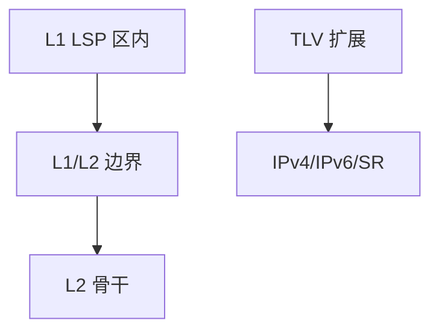

# IS-IS

IS-IS 同样洪泛链路状态、同样跑 SPF，但 PDU 走链路层，层级是 L1/L2，TLV 让它后来比 OSPFv2 更容易带新地址族。

<footer>—— 据 ISO/IEC 10589；RFC 1195 把 IS-IS 用于 IP；RFC 5308 IPv6 整理</footer>

[上一课](/cs/ospf-areas-lsa) 钉死 OSPF 区域。运营商骨干常跑 IS-IS。缺口是**对照**：不是再学一遍 Dijkstra，而是 CLNS 出身的两级层级、LSP 与 TLV。本课不把 RIP 计时器写完。

## 问题

OSPF 是 IP 上的协议，依赖 IP 可达来传 LSA（邻接除外）。IS-IS Hello/LSP 可直接封装在二层，地址族可后加 TLV——历史上加 IPv6、SR 比 OSPFv2 补丁轻松。L1 像非骨干区域，L2 像骨干；L1/L2 路由器相当于 ABR。度量原 6 比特，宽度量后才适合 TE。

不要把 IS-IS 写成「二层路由替代 STP」：它算的是 IP（或 CLNS）下一跳，不是 MAC 洪泛树。

ISO 10589。RFC 1195 引入 IP。DIS 类似 DR 但广播网上选出。本课不背 NET 地址编码。

### 二层 PDU 仍算 IP 下一跳

不是 STP 替代。L1/L2 对应区域分层，TLV 方便加地址族与 SID。与 OSPF 选谁是生态，SPF 同构。

## 方法

对照表：邻接、层级、扩展性、BFD 配套。画：L1 区 → L1/L2 → L2 骨干。与 OSPF 一样可 ECMP。承载 SR 前缀 SID 是后课，这里只承认 TLV 可扩展。

方法止于选定对象与对照；机制才说它如何嵌入已有分层与主干课。

## 机制

主干链路状态课的洪泛可靠性（序号、老化）两边同构。选择哪一个往往是运维传统与 TE/SR 生态，不是容量公式。卫星高延迟链路上 Hello 死亡计时要放宽，与介质无关的协议定时器问题。

DIS 与 OSPF DR：都是减少广播网邻接全网状，细节不同，对象同类。

## 边界

本课不引入 IS-IS 多拓扑的全部。RIP 对照是下一课。后课默认：域内链路状态有 OSPF 与 IS-IS 两套互操作栈，SPF 相同。

不要同时在同一链路上跑两套无必要的 IGP。

上一课留下的缺口在本课收口；「IS-IS」进入后课词汇表后只引用。文献用来钉对象与边界，不把本课写成该主题的独立综述。下一课[RIP 对照](/cs/rip)。

## 小结

- IS-IS：二层 PDU、L1/L2、TLV 扩展。
- 计算仍是 SPF，不是距离向量。
- 与 OSPF 分工是工程生态，不是对错。
- 后课只引用本课钉死的对象，不从该领域总问题重开。
- 出处：ISO 10589；RFC 1195；RFC 5308。
