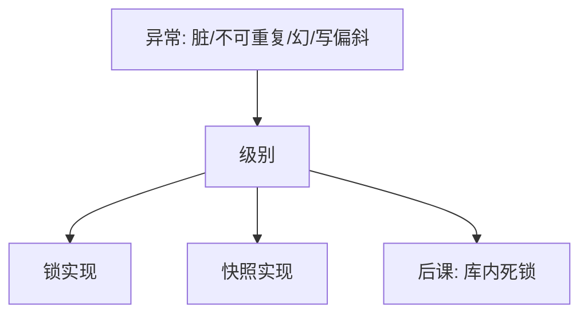

# 隔离级别

SQL 用允许哪些异常来标档，而不是只用冲突图；同一档在锁引擎与 MVCC 上实现可以不同。

<footer>—— Berenson, Bernstein, Gray, Melton, O'Neil and O'Neil, A Critique of ANSI SQL Isolation Levels, SIGMOD 1995</footer>

[上一课](/cs/phantom-write-skew)给出快照与版本。本课不重写可见性函数。缺口是：应用需要比「可串行 / 不可」更细的旋钮。ANSI SQL 用脏读、不可重复读、幻读定义读未提交到可串行；Berenson 等人指出这套异常表既不精确也不完整，快照隔离夹在中间，写偏斜没有名字。

## 问题

严格 2PL 太贵，读未提交又太脏。缺口不是新的并发算法，而是**对实现与用户都可说的档位**：哪些现象允许。读已提交：不读未提交脏数据。可重复读：同一行再读不改。可串行：冲突可串行（或实现声称的等价）。幻读是谓词结果集变，项锁挡不住。

Berenson 补充：丢失更新、写偏斜、读倾斜。本课把它们收成对照表，不把某一厂商的默认档神化。

异常是教学语言；真正的规格仍是允许的调度集合。同一「REPEATABLE READ」在 InnoDB 与另一引擎上可能一个是间隙锁，一个是快照。

## 方法

用现象定义允许集，再用锁或 MVCC 去实现该允许集。读已提交可用短 S 锁或每语句快照。可重复读可用事务快照或长 S 锁。可串行用严格 2PL、SSI 或真串行。本课不规定默认；只要求：选档 = 选允许的异常，代价回写到阻塞与中止率。

## 机制

档位越低，锁越短或快照越松，死锁与阻塞越少，应用必须能容忍相应现象。可串行下写偏斜应消失；SI 默认不消失。这把[ACID](/cs/acid)的 I 从「一个字母」变成可配置的集合。恢复的 A/D 不随级别减弱：未提交仍须 UNDO，已提交仍须 REDO。

## 边界

不要背诵厂商文档当理论。也不要把「最高隔离」与「正确业务」等同：业务不变量可能比冲突可串行更强（应用层约束）。本课不讲分布式隔离、因果一致性。

读未提交在教学上存在，实践几乎不用：它把脏数据交给应用，与[ARIES](/cs/aries-recovery)的 UNDO 窗口叠在一起。后课默认：谈到隔离，先问允许哪些异常、用锁还是快照实现；阻塞等待会进入死锁。

选档是显式的正确性–吞吐交易。应用若不声明能容忍哪种异常，默认档只是厂商的工程选择，不是定理。

## 小结
- 同一档名在锁引擎与 MVCC 上实现可以不同，异常表才是跨引擎的语言。
- 后课死锁随锁变长而变频繁，选档也会选等待图。

- MVCC 与 2PL 是实现；级别是允许异常的用户档。
- ANSI 三现象不够；写偏斜是 SI 的对照缺口。
- 锁等待成环时如何打破，是库内死锁课。
- 出处：Berenson et al., SIGMOD 1995；SQL 标准；Gray and Reuter。
