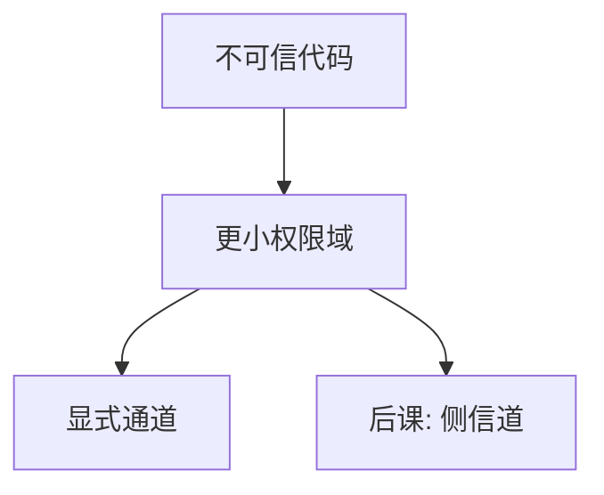

# 隔离与沙箱

把不可信代码放进权限更小的盒子：进程、虚拟机、seccomp 或语言运行时。盒子破了，损失应停在边界上。

<footer>—— 据 Lampson 保护；Saltzer 完全中介；操作系统进程隔离的实践整理</footer>

[上一课](/cs/cfi)在同一地址空间里加 NX 与随机化。本课不重讲页位。缺口是：越界与逻辑漏洞仍会发生，纵深要求**缩小主体能碰的客体**。[内核与用户态](/cs/kernel-user)已把用户进程互相隔开；沙箱是更细的盒子：同一用户下再切，或把解析器、插件、渲染器丢掉大部分系统调用。

## 问题

进程隔离依赖内核引用监视器与各自页表。同一进程里的库没有这层边界。缺口不是再讲页表漫游，而是多层隔离：进程、容器（命名空间+cgroup）、虚拟机、基于语言的 WASM/JVM、系统调用过滤。每一层对应威胁模型里「逃逸之后还剩什么」。

沙箱不是加密。它服务 CIA 的 C/I/A 中「损坏半径」：密钥与主机文件系统尽量不进盒子。侧信道表明：共享硬件时，逻辑盒子仍可能漏。

## 方法

原则：不可信输入的处理者持最小能力集（对照[能力](/cs/capability-vs-acl)）。浏览器多进程：渲染器无文件、无原始套接字。数据库 UDF、浏览器插件同构。本课不比较具体产品，只锁定：隔离 = 另一套页表或另一套系统调用策略 + 明确的数据通道。

## 机制

隔离把保护矩阵的主体变细：不是「用户 www-data」，而是「渲染器实例 #12」。通道（管道、套接字、共享内存）必须再做认证与完整性，否则盒子外的信任会从通道流回去。这与[两阶段提交](/cs/two-pc)的参与者隔离不同：那里假设参与者诚实但会崩溃；这里假设盒子内代码不诚实。

TCB 含内核与监视器。盒子再小，内核漏洞仍是公共逃逸面。缩小 TCB 是微内核对照，不插入本课。

## 边界

逻辑隔离不关共享缓存、时间、风扇噪声——下一课侧信道。也不要把容器当成虚拟机级的威胁模型。内核漏洞可以一次打穿所有进程盒子；那是 TCB 大小问题，不是「没开 ASLR」。

沙箱逃逸是「盒子的引用监视器被绕过」，与盒内越界是不同边界。后课默认：逻辑边界已尽量缩小；共享微结构仍可能泄漏密钥比特。

盒子的数据通道上仍要认证与完整性，否则隔离只是把敌手挪到管道对端。通道策略与盒子权限同样是矩阵的一部分。

## 小结
- 后课默认：逻辑盒子已尽量小，微结构泄漏另计。
- 容器与虚拟机的威胁模型不同：前者共享内核，后者多一层管理程序。
- 后课侧信道说明共享硬件时逻辑盒子仍可能漏密钥。

- NX/ASLR 在盒内减可利用性；本课用更小权限域限制爆炸半径。
- 通道必须显式；沙箱不是加密。
- 共享硬件上的泄漏是侧信道课的缺口。
- 出处：Lampson；Saltzer and Schroeder；操作系统隔离实践。
