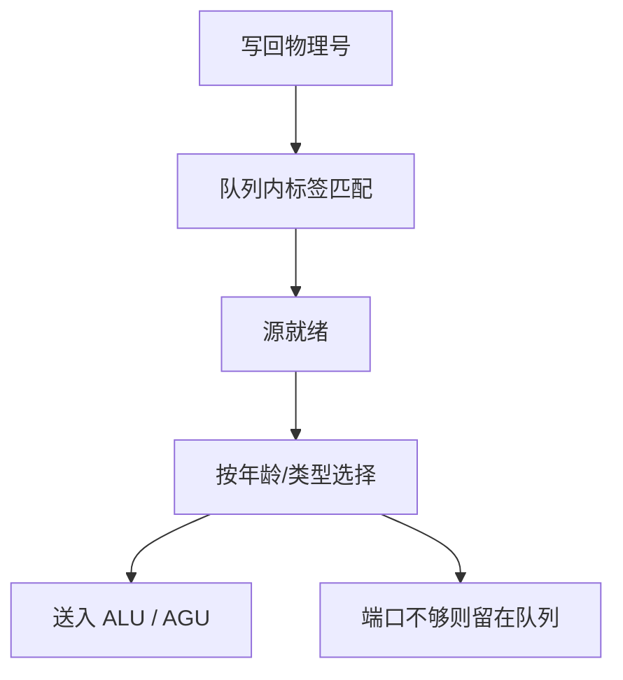

# 发射队列与唤醒选择

保留站变成一张按就绪位挑选的队列：结果写回时用标签匹配把等待者唤醒，选择逻辑再在同一拍里挑出能进 ALU 的那几条。

<footer>—— 据 Palacharla, Jouppi, and Smith, ISCA 1997；Tomasulo, IBM Journal 1967 整理</footer>

[上一课](/cs/prf-free-list)让物理寄存器带就绪位。[Tomasulo](/cs/tomasulo) 的 CDB 广播是唤醒的语义。本课不重讲自由列表。缺口是：**把「操作数齐」变成每拍可调度的硬件——唤醒（wake-up）与选择（select），以及这套逻辑如何限制时钟。**

## 问题

窗口里几十条指令，每拍可能写回 2–4 个物理号。要在下一拍让依赖它们的指令可发，比较器数量随「队列项 × 写回宽度」涨。选哪一条进有限的 ALU 端口：最老优先以逼近程序序、减少无谓冲刷，但比较年龄又加一级逻辑。缺口不是再加物理寄存器，而是**在频率可接受的前提下做匹配 + 仲裁**。

Palacharla 等把超标量的复杂度瓶颈钉在发射窗口：增大窗口提高 ILP，但唤醒/选择的延迟会逼你降频，净性能可能掉。

## 方法

发射队列（IQ / RS）：每项存操作码、源物理号、就绪位、目的物理号。写回总线带物理号；每项比较，匹配则置就绪。两源都就绪则参加选择：按年龄或按类型把最多 $W$ 条送到对应功能单元，占用端口。

load 的就绪来自 cache 命中或转发，延迟可变，所以 IQ 必须允许「发出去又发现 miss 再重发」或「等命中再发」两种设计；细节交给 LSQ 课。

## 机制

[CPI](/cs/cpi-amdahl) 的停顿项多了一类：窗口已满但选择逻辑看得到的就绪指令少于端口——ILP 不够；或就绪很多但端口不够——结构冒险。深窗口提高前者、恶化后者与时钟。

推测：IQ 项带着 ROB 序号，冲刷时按序号作废，与[恢复](/cs/speculation-recovery)同一套年轻指令丢弃。被选择但尚未写回的指令若所在路径冲刷，功能单元结果作废。

## 边界

本课不把 load 越过未算完地址的 store 合法化，那是下一课消歧。也不引入宏融合后「一条 IQ 项对应两条 ISA 指令」——那是前端课。选择逻辑的具体电路（前缀树找最老就绪）不展开。

后课默认：就绪即竞争端口；年龄优先是常见策略。内存相关不能只靠寄存器标签，因为地址在 AGU 之后才有。

## 小结

- 唤醒是物理号匹配，选择是端口仲裁；二者限制窗口与频率。
- 冲刷按 ROB 序号作废 IQ 项。
- 访存相关要 LSQ，下一课才消歧。
- 出处：Palacharla, Jouppi, Smith, *ISCA*, 1997；Tomasulo, 1967。
