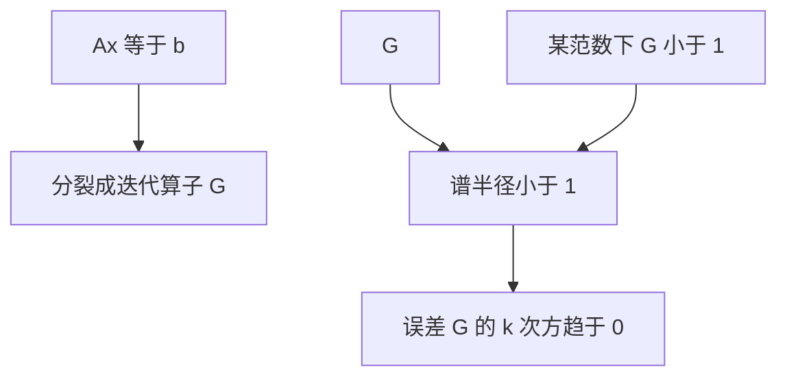

# 迭代法何时收敛

定常迭代 $x_{k+1}=Gx_k+c$ 收敛，当且仅当 $G$ 的谱半径小于一；范数界给出可计算的充分条件，不必先求出全部特征值。

<footer>—— 据 Golub and Van Loan, Matrix Computations；Trefethen and Bau, Numerical Linear Algebra 整理</footer>

上一课[矩阵范数与扰动](/cs/matrix-norm-perturb)写出 $\kappa(A)$ 与残量界。本课不重证扰动定理，也不从 Krylov 百科另起。缺口是：直接消元对大稀疏 $A$ 太贵，**迭代何时保证 $x_k\to x$，收缩率由什么控制**。收敛是算法性质，与 $A$ 的条件数相关但不是同一句话。

## 问题

把 $Ax=b$ 改写成 $x=Gx+c$，迭代 $x_{k+1}=Gx_k+c$。误差 $e_{k+1}=Ge_k$，故 $e_k=G^k e_0$。缺口因此不是「再算几步看看残量」，而是**$\rho(G)<1$ 才收敛**；$\|G\|<1$ 是方便的充分条件，因为 $\rho\le\|G\|$。Jacobi、Gauss–Seidel 给出不同的 $G$；同一 $A$ 上一个收敛另一个可以发散。

条件数大往往使最优迭代的收缩变慢，但不等于发散。发散是 $G$ 把误差放大。本课钉定常线性迭代；共轭梯度等 Krylov 方法只点名：它们不是固定的 $G$，收敛分析换一套，但「看算子是否收缩」的直觉还在。

### 残量变小不是已经收敛到 $x$

与上一课相同：病态时残量可以先小、解仍差。迭代停准则若只看 $\|r_k\|$，可能过早停在一个后向还行、前向很差的点，或在残量振荡时误判。相对 $\|r_k\|/\|b\|$ 与估计的 $\kappa$ 应一起读。也不要把「对角占优就一定快」写成定理：它常给出 $\|G\|<1$，速度仍可能很慢。

Golub and Van Loan 第 10 章讲迭代。Trefethen and Bau 用谱半径讲幂迭代与定常迭代。本课不把多重网格当主干。

## 方法

Jacobi：把对角抽出，$G=I-D^{-1}A$。Gauss–Seidel 用已更新的分量，相当于另一种分裂。检验：对某个容易算的范数检查 $\|G\|<1$，或对简单结构用对角占优保证。谱半径要用特征值，实践中用观察 $\|e_{k+1}\|/\|e_k\|$ 估计渐近因子。

预条件是换一个更容易收缩的等价迭代，目标仍是原 $Ax=b$ 的 $x$。停迭代时交出的 $\hat x$ 要用原 $A$ 的残量与 $\kappa$ 解释，与直接法同一套扰动语言。

对角占优、对称正定等结构给出经典分裂的收敛保证，它们是充分条件，不是「矩阵好看就快」。谱区间越宽，通常 $\rho(G)$ 越接近 1，步数越多——条件数再次出现，只是对象换成迭代算子。直接法对同一病态 $A$ 仍可能一次给出后向稳定解；迭代法可能需要与 $\kappa$ 成正比或更差的步数。选择哪条路是资源问题：填入与时间，对上收敛与停。牛顿内层两者都能用。

## 机制

$G^k\to 0$ 当且仅当所有特征值模小于 1。范数 $>1$ 仍可能 $\rho<1$（非正规时瞬态可能先增长）。这解释了「开头残量变大再下降」：不是实现写错，是 $\|G^k\|$ 可以先升。直接法的稳定性是后向误差；迭代法还要另付收敛税。两者最后都经 $\kappa$ 变成前向误差。

Krylov 方法每步在扩大的子空间里选最优，没有固定 $G$，但同样用范数谈 $\|r_k\|$ 与 $\|e_k\|$ 的下降。预条件改变的是迭代算子，不是原 $A$ 的物理条件——交回的 $\hat x$ 仍对原 $A$ 负责。停在「残量降了两个数量级」上，对 $\kappa\approx 10^8$ 的系统可能连一位解都没有。与直接法分工：直接法一次付分解代价并交出后向稳定的 $\hat x$；迭代法在矩阵只以乘向量出现时便宜，但必须另付收敛与停准则。牛顿课会把每步再变成一次线性求解，两种都可以当内层。

## 边界

本课不证明 CG 的极小残量性质，不讲非线性迭代。下一课[非线性方程与牛顿](/cs/newton-nonlinear)把「迭代」换到 $f(x)=0$。后课默认：定常迭代收敛看 $\rho(G)$；$\|G\|<1$ 是充分条件；残量停准则要连同条件数读。

## 小结

- 定常迭代收敛当且仅当 $\rho(G)<1$。
- 矩阵范数给出可检验的充分条件；瞬态可以先放大。
- 残量小不等于解准，与直接法同一条扰动逻辑。
- 下一课把迭代用到非线性 $f$。
- 出处：Golub and Van Loan；Trefethen and Bau。
