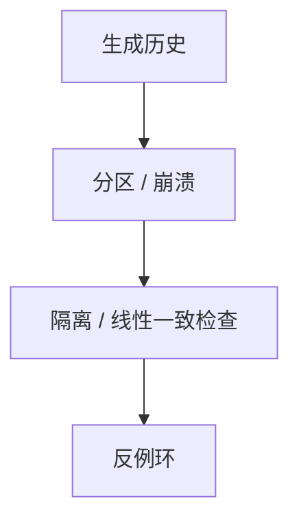

# Jepsen

把网络分区、时钟与进程崩溃当成默认环境，再用线性一致性或声明的隔离级别去核对历史。绿基准盖不住红的 Jepsen 报告。

<footer>—— Kingsbury, Jepsen 分析；分布式隔离与线性一致性文献对照</footer>

[上一课](/cs/tpc-benchmarks)在正常负载下比吞吐。缺口是**声明的隔离在分区下是否仍成立**。本课钉 Jepsen 式对抗；行级安全下一课换访问控制。不提供针对具体产品的利用步骤。

## 问题

厂商写「可串行化」或「线性一致」。Jepsen：生成客户端历史，注入 nemesis（分区、kill、时钟），用 Elle 等检查器找环。缺口是把[故障模型](/cs/failure-models)接到数据库产品——即使该课在树后，机制相同。与 TPC：基准禁止恶意分区；Jepsen 专门恶意。

Kingsbury 的公开分析是方法来源。本课只讲如何读报告：历史、反例、是否改过默认配置。

## 方法

读一份报告：集群拓扑、客户端、nemesis、检查器、反例是否可复述为隔离定义上的环。工程：把同一套故障注入接到 CI，但不要把随机 kill 当唯一测试。与 TLA+：规格先写，Jepsen 找实现偏离。

## 机制

如果历史不能嵌入合法串行（或产品声明的级别），隔离声明失败。时钟跳变破坏依赖「本地时间」的 last-write-wins。多数派在分区下会脑裂，除非有仲裁。模型必须匹配产品承诺：把 SI 当可串行来检查会「误报」——其实是规格写错。异步提交应允许丢失，模型不能当同步 D。

超时 abort 应在历史里是 abort，不是静默丢。搜索引擎 refresh 前不可搜，若合同如此则不是 bug。与 wait-for：分区造成的永远等是故障检测，要进 nemesis。读己之写、单调读可单独当较弱模型测。

## 边界

本课不写攻击 payload，不针对具体产品给利用步骤。下一课 RLS 是授权，不是共识。数据库审计收口责任，与 Jepsen 的「是否撒谎」互补。形式化 TLA+ 是规格先写，Jepsen 找实现偏离。

后课默认：分布式声明要用故障历史检验。吞吐基准不揭示脑裂双主。

## 小结

- Jepsen 用故障注入核对隔离声明，不是压测。
- 读报告看反例与默认配置，不看营销摘要。
- 行级安全下一课。
- 出处：Kingsbury Jepsen；线性一致性 / 隔离级别文献。
