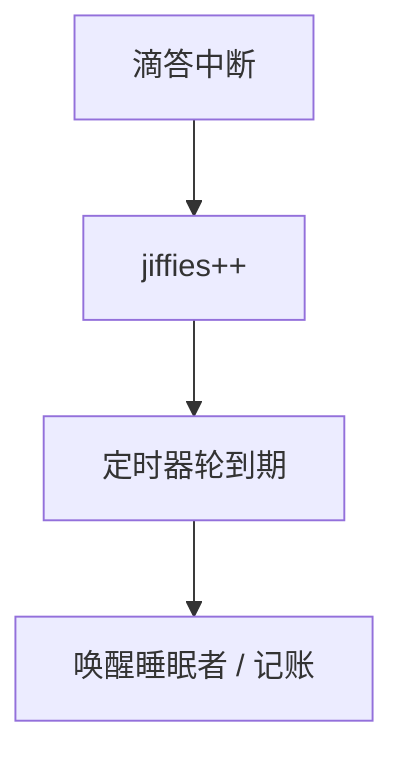

# jiffies

内核用滴答中断累加一个计数器；HZ 次每秒，超时、调度记账和时间片都曾以它为粗粒度时钟。

<footer>—— 据 Bovet and Cesati；Love, Linux Kernel Development；Tanenbaum MOS 整理</footer>

[上一课](/cs/io-uring)的等待可以带超时，却还没有「内核如何数时间」。[时间片](/cs/timeslice-cfs) 已用时间记账，当时把时钟当黑盒。[中断下半部](/cs/interrupt-bottom-half) 假定定时器 IRQ 会来。缺口是 **jiffies**：滴答、HZ、回绕、以及它不够精细——留给下一课 hrtimer。

## 问题

若每次睡眠都读 CPU 周期计数器，旧机器没有或不同核会漂。经典 Unix：编程间隔定时器，HZ（如 100 或 250）次每秒加一。超时时刻记成「未来的 jiffies」。缺口：谁在 IRQ 里加一、32 位回绕如何比较、用户 `sleep` 的分辨率不能高于滴答。动态 HZ 与无滴答（tickless）是实现，对象仍是「软件时间基」。

本课不把每架构的时钟事件设备编程写完。

比较用有符号差处理回绕。jiffies 不是 UTC；墙上时钟是另一套（xtime），可被 NTP 调。本课只钉单调滴答。

## 方法

时钟 IRQ → 更新 jiffies → 检查定时器轮（timer wheel）上到期的软件定时器 → 可能标记调度。进程在内核睡眠时把「目标 jiffies」挂进等待队列。超时与 [select](/cs/select-poll) 共用这条。不要把 TSC 校准全文展开；jiffies 可以由更高精度时钟累加出来。

## 机制

jiffies 把时间变成整数，让 OS 能在没有用户态时钟的情况下做公平调度与 I/O 超时。分辨率与延迟下限被 HZ 绑住：HZ=100 则 10ms 粒度。这解释了为何管道超时与 nanosleep 在旧内核上不准。下一课用时钟事件设备实现更高分辨率，而不必把 HZ 拉到十万。

与组成课的时钟域不同：这里是软件计数，不是 PLL。

## 边界

本课不引入 CLOCK_MONOTONIC 的全部 POSIX 钟。不保证虚拟机里滴答与真时间 1:1（偷时间）。下一课：纳秒级期限与红黑树定时器。

后课默认：粗超时可用 jiffies。细期限与高精度时钟事件，下一课 hrtimer。

## 小结

- jiffies 由滴答累加，驱动 timer wheel 与记账。
- 分辨率受 HZ 限制，回绕用有符号差比较。
- 高精度定时是 hrtimer 的缺口。
- 出处：Bovet and Cesati, *ULK*；Love, *LKD*；Tanenbaum *MOS*。
