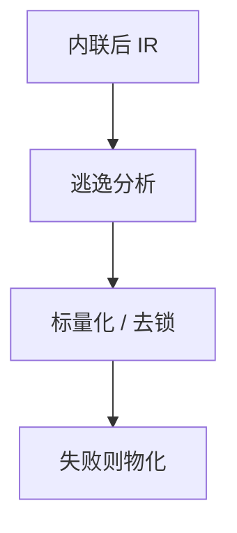

# JIT 中的逃逸分析

在热方法的编译单元里做逃逸分析：未逃逸则可标量化、拆锁、栈分配。比 AOT 更敢，因为去优化能在假设失败时物化对象。

<footer>—— 据 Choi 等；HotSpot 逃逸分析；对照中端[逃逸分析](/cs/escape-analysis) 整理</footer>

上一课[分层编译](/cs/tiered-compilation) 的顶层才跑贵分析。中端 EA 课已给 NoEscape。缺口是 **JIT 增量**：编译单元是内联后的一片，不是全程序；失败靠[去优化](/cs/deoptimization) 物化。本课钉差异，内存管理单元下一课从 GC 算法接。

## 问题

AOT 无 deopt，EA 必须对所有调用保守。JIT：未知调用若在本方法内联消失，对象未逃逸。锁消除：线程局部对象的 synchronized 可删。缺口是**与去优化合同**，不是 Choi 算法重推。

循环分配：若对象每圈 new 且不逃逸，可标量化成寄存器——垃圾更少。

### JIT EA 不是 GC

它减少分配，GC 仍处理逃逸对象。不要声称 EA 替代回收。

HotSpot EA。与 Choi/Blanchet 同一问题，不同失败通道。本课强调物化。

## 方法

内联后跑连接图或数据流。标记标量替换候选。生成码不分配，deopt 描述符记录如何 new 回来。

与[SROA](/cs/sroa)：同一变换，JIT 因开世界+deopt 收益更大。

## 机制

并发：分析时类层次可再加载 → 失效码。安全点与锁膨胀交互复杂。不要消除可能被其它线程看见的锁。

分配消除改变 TLAB 压力，后课 bump 分配再谈。

## 边界

本课不写 GC 算法。后课默认：顶层 JIT 可激进 EA。下一课复制式 GC：堆侧如何收仍逃逸的对象。

也不把 EA 当所有权类型；那是静态纪律。

## 小结

- JIT EA 吃内联后的闭包，失败靠物化。
- 锁消除与标量化是主要收益。
- 不替代 GC。
- 出处：Choi et al.；HotSpot EA；对照 Hölzle 去优化。
