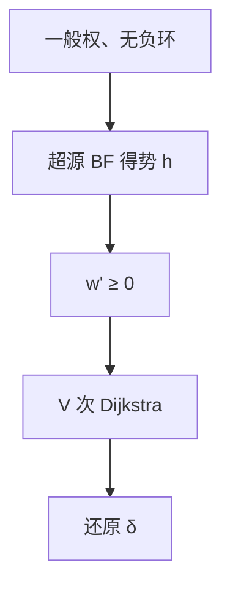

# Johnson 全源

先用一次 Bellman–Ford 给每个点势，把边权改写成非负；再从每个源跑 Dijkstra，得到一般权图上的稀疏全源。

<footer>—— 据 Johnson, Efficient Algorithms for Shortest Paths in Sparse Networks, 1977；CLRS 第 25.3 节整理</footer>

上一课[Floyd–Warshall](/cs/floyd-warshall)用中间点 DP 在 $\Theta(V^3)$ 内做全源，并声明稀疏非负更宜 $V$ 次 Dijkstra、一般权不要对负边跑 Dijkstra。本课不重写三重循环。缺口是**重新赋权**：势函数 $h(v)=\delta(s',v)$ 使 $w'(u,v)=w(u,v)+h(u)-h(v)\ge 0$，最短路的顶点序列不变。有负边、无负环的稀疏图因此回到堆 Dijkstra。

## 问题

$V$ 次 Bellman–Ford 是 $O(V^2 E)$，稠密时比 Floyd 差，稀疏时仍厚。Johnson：加超源 $s'$ 向所有点连 $0$ 边，Bellman–Ford 一次得 $h$，检测负环。新权 $w'$ 非负，且对任意路径 $p$，$w'(p)=w(p)+h(\mathrm{start})-h(\mathrm{end})$，故同一 $u,v$ 之间最短路在 $w$ 与 $w'$ 下是同一条。对每个 $u$ 跑 Dijkstra（$w'$），再还原 $w$ 的距离。二叉堆下 $O(VE\log V)$ 量级，稀疏时优于 $V^3$。

缺口是势，不是再发明全源 DP。势来自[差分约束](/cs/diff-constraint)同一三角不等式：$h(v)\le h(u)+w(u,v)$ 当 $h=\delta(s',\cdot)$。

### 重新赋权不是改图的可达性

$w'$ 可以让边的数值变大，但 $w'(u,v)=0$ 不表示原图有零权。负环仍先被超源那一次 BF 抓住；有负环则算法拒绝，与 Floyd 对角负值同一语义。

Johnson 1977。CLRS 25.3。势 $h$ 不必是最短路：任意使 $w'$ 非负的势都保持最短路集合；超源 BF 是一份可计算的势。

## 方法

建 $s'$。BF：失败则负环。成功则算 $w'$。对每个 $u$：Dijkstra 得 $\delta'(u,\cdot)$，令 $\delta(u,v)=\delta'(u,v)-h(u)+h(v)$。不可达保持 $\infty$。

实现用[Dial 与堆变体](/cs/dijkstra-heap)里选定的队列。稠密图直接 Floyd 更干净，不必 Johnson。

## 机制

路径上中间 $h$ 消掉，只剩端点，故比较 $w'$ 最短即比较 $w$ 最短。不要在原负权图上对每个源 Dijkstra。也不要把势当成启发式 $A^*$ 的 $h$：这里的 $h$ 来自超源，保证非负，不是到汇的估计。

空间仍可 $O(V^2)$ 存答案；算法的时间优势在 $E=o(V^2/\log V)$ 一类稀疏。

## 边界

本课不写费用流、不加速动态边权。负环上「最短」无定义。后课最小生成树换成无向边权和，不是点对距离。后课默认：稀疏一般权全源用 Johnson；稠密用 Floyd。

## 小结

- 势把一般权变成非负，最短路径集不变。
- 一次 BF + $V$ 次 Dijkstra；负环在 BF 处拒绝。
- 稠密仍 Floyd。
- 出处：Johnson, 1977；CLRS 第 25.3 节。
