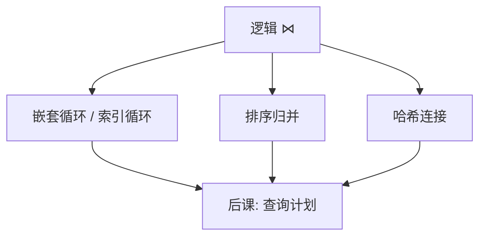

# 连接算法

逻辑连接只有一种含义；物理上嵌套循环、排序归并与哈希是三种不同的 I/O 形状。

<footer>—— 据 Blasgen and Eswaran, 1977；Ramakrishnan and Gehrke 对连接算子的整理</footer>

[上一课](/cs/sql-null)把查询钉成声明：含义在代数，不在扫描顺序。本课不重写 `SELECT`。缺口是：$\bowtie$ 在磁盘上怎么算。元组在[文件](/cs/file-bytestream)里，页经[缓冲](/cs/buffer-dirty)进出内存；连接算法决定读多少页、要不要排序、要不要建哈希表。

## 问题

两表等值连接的指称是「键值相等的元组对」。实现若只会双重循环扫全表，大表上不可用。缺口不是新的关系运算，而是三种经典物理算子：嵌套循环（可带索引）、排序归并、哈希连接。本课不选优化器，只把每种算子的 I/O 形状交给后课计划。

外存代价按页计，不是按元组计。[B 树](/cs/btree-external)已经能按键定位；索引嵌套循环就是「外层每条探针走一次索引」，不是另一种逻辑连接。

## 方法

嵌套循环：对外层每一元组（或每一页）扫描内层。有索引时，内层查找从全表变成点查或范围查。排序归并：两输入按连接键排序（或已有序），然后一次归并扫描。哈希连接：把较小一侧建成内存哈希表（或分区后逐桶建表），另一侧探针。

## 机制

三种算子实现同一指称，代价形状不同。嵌套循环对高度选择的探针便宜，对两次全表笛卡尔积式扫描极贵。排序归并吃排序的 $I/O$，但输出自然有序，可供后继归并或 `ORDER BY` 免排。哈希连接对等值连接通常最少随机 I/O，但不等值、范围连接用不上；内存不够时要分区，回退成多趟。

块嵌套循环把「元组对元组」改成「页对页」，缓冲池命中率决定常数。本课不引入并行 hash join 的全部划分协议，只要求：算子是计划树的节点，有输入基数与内存预算。

## 边界

本课不写代价公式的数字表，那是[代价估计](/cs/cost-estimate)。也不处理星型、迟物化、索引下推的全部变体。外连接、半连接是同一族算子加标记，语义缺口已在代数/SQL，这里只承认物理上多一条空匹配路径。

多表连接是两两算子的树，不是一个 $n$ 路魔法；谁与谁先连，由后课计划决定。后课默认：谈到连接，逻辑一层、物理三族；计划树从这些算子里挑，而不是从文件循环里现场发明。

三种算子都可以流水线或物化；哈希建表是物化点，索引循环更像探针。后课计划树把这些点标出来，本课只要求认得 I/O 形状。

## 小结

- 声明已在；本课只交出嵌套循环、排序归并、哈希三种 I/O 形状。
- 索引嵌套循环复用 B 树，不是新模型。
- 选哪一种是后课计划与代价的缺口。
- 出处：Blasgen and Eswaran, 1977；Garcia-Molina, Ullman and Widom；Ramakrishnan and Gehrke。
