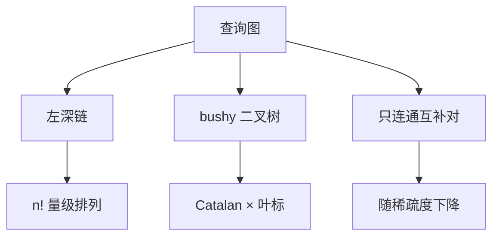

# 连接顺序搜索空间

左深树是链，bushy 树允许两侧都是连接结果；再限制「只连接有谓词的分量」，空间从阶乘降到连通子图。

<footer>—— 据 Vance and Maier；Moerkotte and Neumann, DPCCP；Selinger 左深限制对照</footer>

[上一课](/cs/selinger-dp)在左深子集 DP 上钉了有趣序。本课不重写支配剪枝。缺口是树形本身：左深、右深、bushy，以及是否允许无连接谓词的笛卡尔积中间结果。空间大小决定 $n{=}12$ 还能不能精确 DP。

## 问题

左深：每个连接的一侧是基表。哈希连接时 build 侧若总是「到目前为止的结果」，内存形状固定，流水线友好。bushy：两边都可以是子连接树，有时避免巨大中间结果（两对小连接先做完再连）。右深用于某些并行流水。缺口是**枚举哪些二叉树**，不是再定义 ⋈。

笛卡尔积：查询图不连通时必须做积。连通查询上，若仍枚举断开子集，会多出极贵的积。DPccp 只枚举连通互补对，空间随查询图稀疏度降。星型查询与链状查询的图完全不同。

Moerkotte and Neumann 的 DPCCP 在连通补对上 DP。Vance and Maier 讨论 bushy 枚举。启发式（GOO、IKKBZ）在 $n$ 太大时替换精确 DP，本课点名不把启发式当最优。

## 方法

查询图：顶点关系，边是连接谓词。合法连接：两连通分量之间有边（或显式允许积）。左深 DP：状态仍是子集，扩展点必须与 $S$ 有边。bushy DP：状态是子集，转移是拆成两个非空互补连通子集。

超时与截止：精确搜不完就返回当前最佳（任意时间算法）。这与自适应处理不同：这里还在优化时，尚未执行。

## 机制

外连接有顺序限制：不能随便交换左右，bushy 形状更受限。半连接可当缩减器插在真连接前（分布式后课）。代价模型必须给笛卡尔积很高的估计，否则 DP 会「先积再滤」——谓词下推本应先避免积，逻辑改写与物理搜索要配合。

并行与交换算子后课才加；本课空间仍是逻辑连接树加物理算法标签。

## 边界

本课不量化基数误差如何沿 bushy 树爆炸——下一课。也不把遗传算法、模拟退火写进主干必做，只承认 $n$ 很大时近似搜索存在。

后课默认：谈到连接顺序，先画查询图，再选左深或 bushy、是否强制连通。星型多表不是「随便 nested loop」。

搜索空间是优化器的复杂度来源；有趣序是每个节点上的标签，不是另一套空间。

## 小结

- 左深、bushy、连通限制决定能否精确 DP。
- 断开子集等于中间笛卡尔积，通常应禁止。
- 基数估计误差传播下一课：空间搜对了，数字错仍选错树。
- 出处：Selinger；Vance and Maier；Moerkotte and Neumann。
