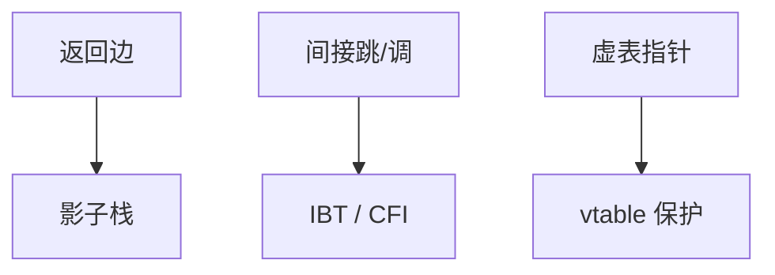

# JOP / COP

没有 `ret` 也能缝：间接跳转与间接调用同样是可编程的控制流边。名字换成 JOP/COP，合同仍是「谁能写函数指针」。

<footer>—— 据 Checkoway 等对非 ret 缝合的讨论；对照 CFI 对间接跳转的约束</footer>

## 定位

上一课[ROP](/cs/rop)以返回为缝。缺口是**间接 jmp/call**：vtable、回调、插件表。本课对照，仍不给缝合教程。

后课默认已经读完本课钉下的合同，只补差，不从该领域第一性原理重开。

## 问题

影子栈主要钉返回。若对象虚表指针可被改，调用仍走攻击者选的槽。JOP/COP 是文献名。缺口是：所有间接控制转移都要合法目标集。

### C++ 虚表

类型混淆后课会再来。这里只点：伪造 vptr 是控制流问题。

文献表明去掉 ret 不等于去掉编程能力。CET 间接分支跟踪后课。

## 方法

把控制边分类：返回、间接跳、间接调。每类对应缓解：影子栈、IBT/CFI、vtable 保护。强调堆上的函数指针与栈返回同样是控制数据。

图中节点是本课的机制骨架；课程不把图展开成可运行的攻击步骤。

## 机制

控制流完整性必须覆盖全部间接边。下一课离开控制数据，看堆上的对象生命周期：释放后仍用。

前提写进合同之后，游戏外的误用只当失败模式点名，不在本课写成操作程序。

## 边界

本课无 gadget 表。堆 UAF 下一课。

## 小结

- ROP 不是唯一缝合；间接跳/调同类。
- 虚表与回调是控制数据。
- CFI 要覆盖返回以外的边。
- 下一课堆 UAF。
- 出处：Checkoway et al.；Abadi et al., CFI。
