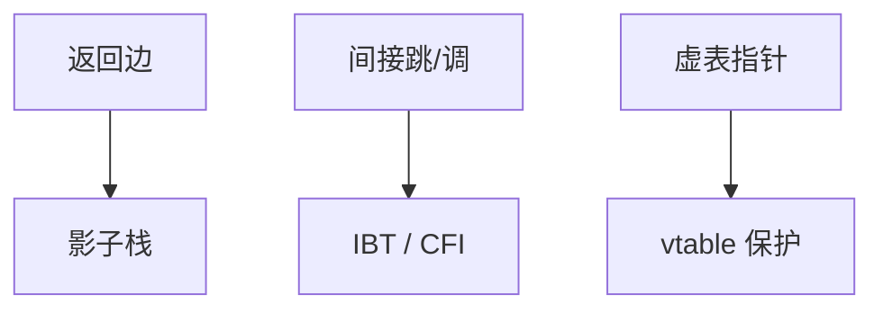
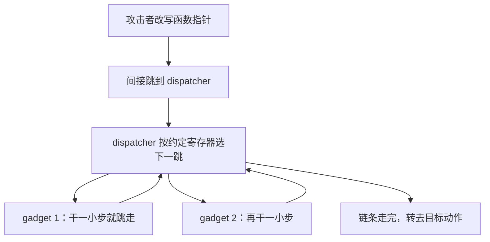

# JOP / COP

没有 `ret` 也能缝：间接跳转与间接调用同样是可编程的控制流边。名字换成 JOP/COP，合同仍是「谁能写函数指针」。

<footer>—— 据 Checkoway 等对非 ret 缝合的讨论；对照 CFI 对间接跳转的约束</footer>

上一课[ROP](/cs/rop)以返回为缝。缺口是**间接 jmp/call**：vtable、回调、插件表。本课对照，仍不给缝合教程。

后课默认已经读完本课钉下的合同，只补差，不从该领域第一性原理重开。

## 问题

影子栈主要钉返回。若对象虚表指针可被改，调用仍走攻击者选的槽。JOP/COP 是文献名。缺口是：所有间接控制转移都要合法目标集。

术语翻译：JOP（jump-oriented programming）就是把间接跳转当「缝衣针」、把代码碎片缝成攻击链的手段；COP（call-oriented programming）则改用间接 call。两者都需要一个 dispatcher（调度员）来按顺序分发执行。

### C++ 虚表

类型混淆后课会再来。这里只点：伪造 vptr 是控制流问题。

文献表明去掉 ret 不等于去掉编程能力。CET 间接分支跟踪后课。

直觉类比：vtable 像一家店的「服务菜单」，对象手里只握着菜单的地址。攻击者只要把菜单地址换成自己印的假菜单，对象照单点菜——调出来的全是攻击者准备的函数。

## 方法

把控制边分类：返回、间接跳、间接调。每类对应缓解：影子栈、IBT/CFI、vtable 保护。强调堆上的函数指针与栈返回同样是控制数据。

```mermaid
flowchart TD
  RET["返回边"] --> SS["影子栈"]
  IJ["间接跳/调"] --> IBT["IBT / CFI"]
  VP["虚表指针"] --> VTP["vtable 保护"]
```

## 机制

控制流完整性必须覆盖全部间接边。下一课离开控制数据，看堆上的对象生命周期：释放后仍用。

常见误区：初学者容易以为「保护好返回地址就安全了」。实际上 vtable、回调、插件表里的函数指针和返回地址一样是控制数据——CFI 只要漏掉任何一类间接边，攻击链就能从那条边钻进去。

```mermaid
flowchart TD
  A["攻击者改写函数指针"] --> B["间接跳到 dispatcher"]
  B --> C["dispatcher 按约定寄存器选下一跳"]
  C --> G1["gadget 1：干一小步就跳走"]
  G1 --> C
  C --> G2["gadget 2：再干一小步"]
  G2 --> C
  C --> E["链条走完，转去目标动作"]
```

## 边界

本课无 gadget 表。堆 UAF 下一课。

## 小结

- ROP 不是唯一缝合；间接跳/调同类。
- 虚表与回调是控制数据。
- CFI 要覆盖返回以外的边。
- 下一课堆 UAF。
- 出处：Checkoway et al.；Abadi et al., CFI。
