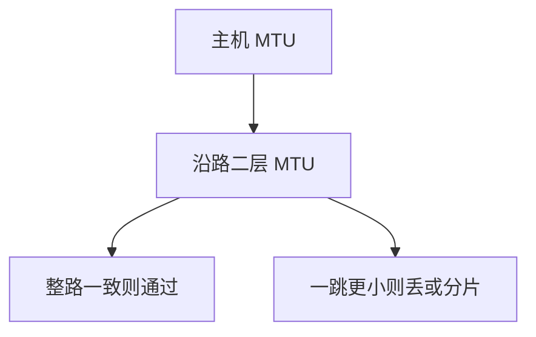

# 巨帧与 MTU

标准以太网载荷 1500 字节是历史互操作点；巨帧摊薄头开销，但路径上任一跳更小就会分片或丢弃。

<footer>—— 据 IEEE 802.3 最大帧；RFC 1191 / 8201 路径 MTU；Kurose and Ross MTU 节整理</footer>

[上一课](/cs/pause-pfc)管队列反压，不管帧有多长。主干[IP 分片](/cs/ip-fragment) 已说明 MTU。缺口是**链路上把帧做大**：jumbo（常见 9000 字节载荷）降低 PPS 与头税，要求 VLAN、LACP、整条二层路径一致。本课不把 LACP 状态机写完。

## 问题

每帧都有 MAC/IP/TCP 头。1500 在十吉比特上 PPS 仍高，CPU 与交换芯片查表次数多。加大 MTU 减帧数。代价：缓冲按最大帧预留；混合 1500/9000 的路径上，ICMP 需要分片或 PMTUD 后课才细讲——本课只钉二层必须先能装下。FCS 仍覆盖整帧，出错重传一整颗巨帧，无线或高误码介质上不划算。

「Baby giant / 1518 vs 1522」是 VLAN tag 的历史缺口，已在主干 VLAN 课点过，这里不重推导。

9000 不是 IEEE 强制；厂商扩展。数据中心常见，广域互联网核心不假设巨帧。

### 加大 MTU 不提高 $C$

只摊协议头与 PPS。路径最小 MTU 是公约数；混用 1500/9000 会丢或分片。FCS 失败时巨帧重传更痛。

## 方法

配置：口 MTU、SVI、路由口、隧道外层各算一次。画：端主机 9000，中间交换机 1500 → 巨帧被丢，不是被 PAUSE。对照：提高 MTU 不提高 $C$，只摊协议头。

方法止于选定对象与对照；机制才说它如何嵌入已有分层与主干课。

## 机制

TSO 后课会在主机侧切段；巨帧是链路允许更大的切。两者正交。PFC 缓冲阈值按最大帧计算，否则巨帧一来就过阈。容量仍是符号率的事：巨帧不增加 $C$。

与[端到端](/cs/layering-e2e)：更大的帧让链路 FEC/CRC 失败代价变大，所以高误码链路保持小帧。

## 边界

本课不把 PMTUD 黑洞写完（网络层进阶）。LACP 是下一课。后课默认：jumbo 是路径最小 MTU 的公约数问题，不是单口开关。

不要把 64 字节最小帧与巨帧对调：最小帧管冲突槽历史与填充，仍在。

上一课留下的缺口在本课收口；「巨帧与 MTU」进入后课词汇表后只引用。文献用来钉对象与边界，不把本课写成该主题的独立综述。下一课[LACP](/cs/lacp)。

## 小结

- 1500 是互操作默认；jumbo 摊头税、要路径一致。
- 加大 MTU 不提高香农容量。
- 分片/丢弃发生在最小 MTU 跳。
- 后课只引用本课钉死的对象，不从该领域总问题重开。
- 出处：IEEE 802.3；RFC 1191；Kurose and Ross。
