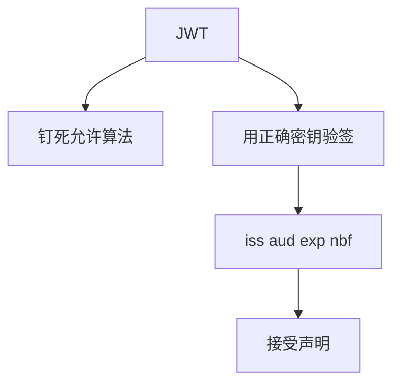

# JWT 陷阱

JWT 把声明做成可验的紧凑串。陷阱是算法可切换成 none、用对称密钥去验非对称、不验 aud/exp，于是「有令牌」再次变成装饰。

<footer>—— RFC 7519；RFC 7515 JWS；Jones、Bradley 与 Sakimura；对照 auth0/jwt 误用报告一类公开分析</footer>

## 定位

上一课[ARP](/cs/arp-spoofing)结束信道映射。身份课序从**应用令牌**起。主干会话可能已有 cookie；JWT 常被当成无状态银弹。缺口是声明合同与算法混淆，不给伪造步骤。

后课默认已经读完本课钉下的合同，只补差，不从该领域第一性原理重开。

## 问题

`alg=none`、把公钥当 HMAC 密钥、不检查 `iss`/`aud`、过长有效期、把权限写进不可吊销的胖令牌。缺口是验证库的默认值，不是 JSON 语法。

### 签名≠加密

JWS 可验不可隐藏。敏感声明要 JWE 或根本不要放进去。

RFC 7519。本课禁止构造恶意 JWT 的操作指导。密钥轮换与 `kid` 注入是实现问题：只接受已知 kid。

## 方法

列出必须检查的头与声明。对照服务端会话：可吊销、可短。JWT 适合短命访问令牌，刷新走服务端。下一课会话管理把 cookie 旗标收全。

图中节点是本课的机制骨架；课程不把图展开成可运行的攻击步骤。

## 机制

无状态的代价是吊销难。证明在「验签+声明」游戏内；`none` 与错钥是游戏外。OAuth 后课会发这种令牌——先把验法钉死。

前提写进合同之后，游戏外的误用只当失败模式点名，不在本课写成操作程序。

## 边界

本课不写全部 JOSE 算法套件。会话管理下一课：cookie、CSRF、固定。

## 小结

- 信道映射之后，应用身份常是 JWT。
- 钉算法、验签、验 aud/exp；JWS 不保密。
- 胖令牌难吊销；宜短命。
- 下一课会话管理。
- 出处：RFC 7519；RFC 7515；对照 OWASP 对 JWT 的讨论（机制，非利用手册）。
