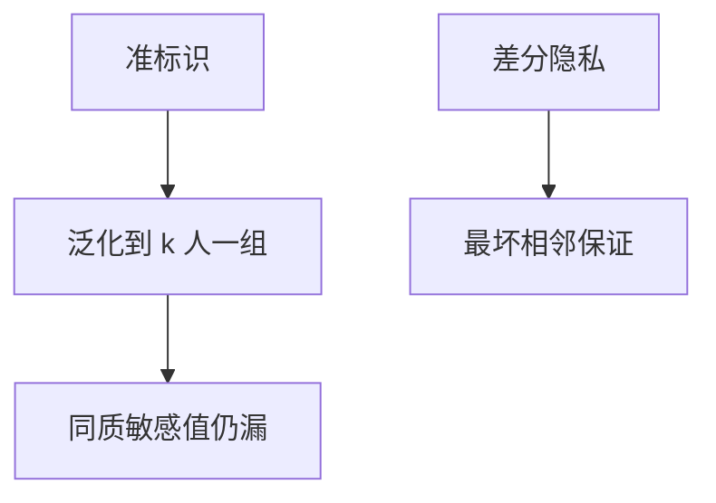

# k-匿名

k-匿名要求每条准标识组合至少对应 k 人。它挡直接指名，挡不住同质敏感值与背景知识。后续有 l-多样与 t-接近，但句法方法仍弱于 DP 的最坏保证。

<footer>—— Sweeney, k-anonymity, International Journal on Uncertainty, Fuzziness and Knowledge-based Systems, 2002</footer>

## 定位

上一课[差分隐私](/cs/differential-privacy)给最坏可加预算。缺口是工程上仍常见的 **k-匿名表**。本课讲它挡什么、不挡什么。

后课默认已经读完本课钉下的合同，只补差，不从该领域第一性原理重开。

## 问题

去掉姓名仍可用邮编+生日+性别再识别。k-匿名泛化准标识。缺口是同质性攻击：k 人同一病。

### 组合发布

多张 k-匿名表可交叉破。DP 的组合定理在此缺席。

Sweeney 2002。GDPR 下一课把法律要求接到技术。

## 方法

对照 DP。指出医疗公开数据事故作为动机（点名类别，不复盘操作）。下一课 GDPR 技术含义。

图中节点是本课的机制骨架；课程不把图展开成可运行的攻击步骤。

## 机制

句法匿名是启发式。法律下一课不会只接受 k。

前提写进合同之后，游戏外的误用只当失败模式点名，不在本课写成操作程序。

## 边界

不写再识别教程。GDPR 技术含义下一课。

## 小结

- DP 有预算；k-匿名是句法。
- 挡指名，不挡同质与背景知识。
- 多表发布会交叉。
- 下一课 GDPR。
- 出处：Sweeney, 2002；对照 Dwork and Roth。
