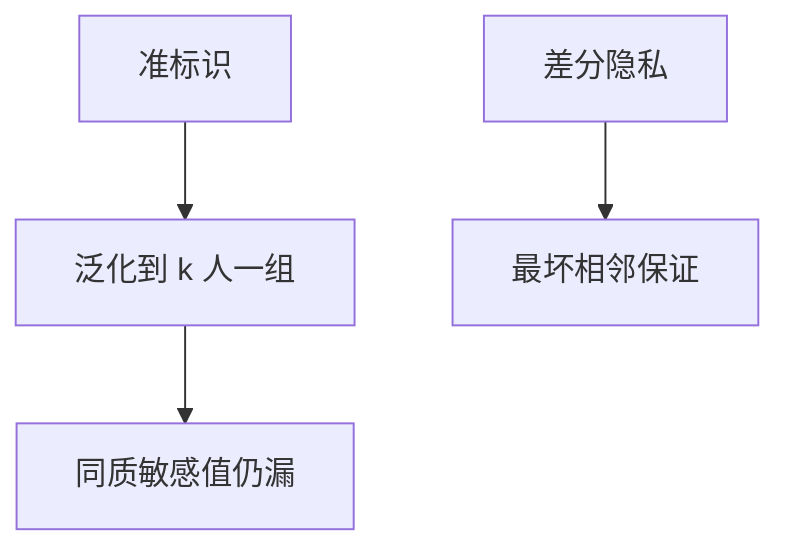
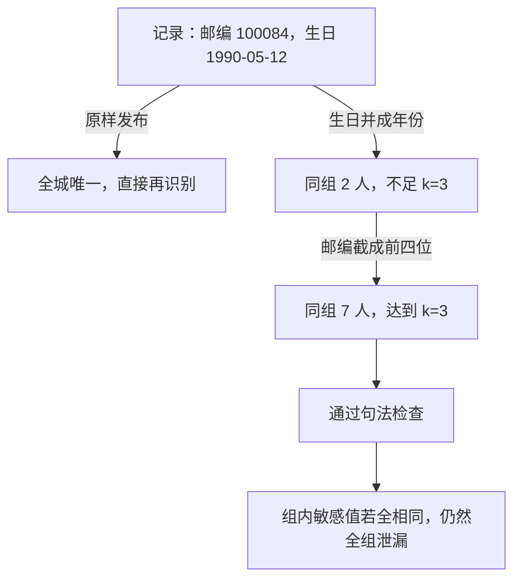

# k-匿名

k-匿名要求每条准标识组合至少对应 k 人。它挡直接指名，挡不住同质敏感值与背景知识。后续有 l-多样与 t-接近，但句法方法仍弱于 DP 的最坏保证。

<footer>—— Sweeney, k-anonymity, International Journal on Uncertainty, Fuzziness and Knowledge-based Systems, 2002</footer>

上一课[差分隐私](/cs/differential-privacy)给了最坏情形可加预算的保证；缺口是工程与合规里仍到处出现的 **k-匿名表**。本课讲它挡什么、不挡什么，与 DP 的差距在哪。

后课默认已经读完本课钉下的合同，只补差，不从该领域第一性原理重开。

## 问题

去掉姓名字段不等于匿名：邮编、生日、性别的组合在人口里常常唯一，Sweeney 据此演示过再识别。k-匿名的回答是泛化准标识——邮编截成前三位、生日并成年度——直到每个准标识组合至少对应 k 人。缺口是同质性攻击：一组 k 人若敏感值全相同（k 人患同一病），「这组里有病」就等于「这组每人都有病」，组内是完全泄漏。

术语翻译：准标识（quasi-identifier）就是「不在名单上、却能锁定你」的字段组合——邮编、生日、性别这些看似无害的列。单列不唯一，组合起来常常唯一。

数字实例：Sweeney 统计过，约 87% 的美国人能被「邮编 + 生日 + 性别」三元组唯一锁定——三亿人里大半带着天然指纹。这就是为什么删掉姓名一列远远不叫匿名化。

### 组合发布

多次发布更糟：同一人群的两张 k-匿名表放在一起，准标识可交叉还原——k-匿名没有 DP 那样的组合定理，发布两次，保证就漏两次。

Sweeney 2002。GDPR 下一课把法律要求接到技术。

## 方法

方法是把 k-匿名与 DP 并排对照：k-匿名是句法性质——只看表结构就能检查，不对攻击者的背景知识做假设；DP 是语义性质——对相邻数据集给概率保证。动机按类别点名：医疗与行政公开数据一再发生再识别事故，由此推动 l-多样（组内敏感值至少 l 种）与 t-接近（组内敏感值分布贴近整体）的修补。下一课 GDPR 技术含义。

```mermaid
flowchart TD
  QID["准标识"] --> GEN["泛化到 k 人一组"]
  GEN --> HOMO["同质敏感值仍漏"]
  DP["差分隐私"] --> WORST["最坏相邻保证"]
```

## 机制

机制上，句法匿名是启发式：它挡「直接指名」，对攻击者知道什么不做任何建模——攻击者一旦知道目标在某组里，组的保证立刻缩水到那一组。l-多样与 t-接近各自封一条同质或分布攻击，但封不完：攻击者的知识集合无法枚举，这正是 DP 用「相邻数据集」重新定义问题的原因。法律下一课不会只接受 k。

```mermaid
flowchart TD
  A["记录：邮编 100084，生日 1990-05-12"] -->|"原样发布"| B["全城唯一，直接再识别"]
  A -->|"生日并成年份"| C["同组 2 人，不足 k=3"]
  C -->|"邮编截成前四位"| D["同组 7 人，达到 k=3"]
  D --> OK["通过句法检查"]
  OK --> BUT["组内敏感值若全相同，仍然全组泄漏"]
```

## 边界

不写再识别教程；边界要点名：k 的取值没有原理性答案，从 k=5 提到 k=50 只是抬高再识别成本一段，而泛化每加深一层，数据的分析价值就跌一层。GDPR 技术含义下一课。

常见误区：初学者容易以为「把 k 设得越大越安全」。实际上泛化每糊一层，年龄、地域的精度就丢一层，统计价值跟着掉——k 是隐私与效用之间的旋钮，不是越高越好的安全等级。

## 小结

- DP 有预算；k-匿名是句法。
- 挡指名，不挡同质与背景知识。
- 多表发布会交叉。
- 下一课 GDPR。
- 出处：Sweeney, 2002；对照 Dwork and Roth。
