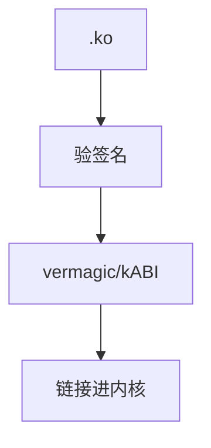

# kABI 与模块签名

发行版冻结一组内核符号的 ABI，使闭源或 DKMS 模块可在更新间加载；模块签名让 [Secure Boot](/cs/secure-boot) 下只有可信模块能进核。

<footer>—— 据 Linux 模块签名文档；发行版 kABI 白皮书直觉；[livepatch](/cs/livepatch) 为替换对照</footer>

[配置](/cs/kernel-config-build) 产出模块。缺口是 **能不能加载**：符号 CRC、签名、与 GPL-only 符号。观测/安全启动课序在此收口。

## 问题

`modprobe` 解析未定义符号。kABI：发行版保证部分符号稳定。缺口：自己编的内核无此保证；签名：`CONFIG_MODULE_SIG`，密钥在 MOK。本课不把如何绕过签名当内容。

 vermagic 匹配配置。对象是加载策略，不是 C 调用约定课。

## 方法

加载：验签名 → 验 vermagic → 重定位。对照 [capabilities](/cs/linux-capabilities)：`CAP_SYS_MODULE`。对照 livepatch：也是模块。对照 [ioctl](/cs/chardev-ioctl)：模块常注册 cdev。

## 机制

kABI+签名把「内核可扩展」限制在可信与兼容的模块上，服务稳定性和安全启动。自编译内核则你就是 ABI。不要写成驱动商店。与 [eBPF](/cs/ebpf-observability)：BPF 不走模块符号表同一套。

崩溃的模块 taint 内核，影响支持。

实现上：CRC 对符号类型变了就会拒载。Secure Boot 下未签名模块直接失败。GPL-only 符号限制专有模块能钩的深度。 读法上只引用[上一课](/cs/kernel-config-build)的结论，不把对象换成训练推理或限价簿。

本课在操作系统进阶的「安全、启动与调试 / 观测与调试」课序里，对象是 **kABI 与模块签名**。

- 先修只引用，不重导：上一课的结论当公理，本课只补差。
- 五栏不吞并：不把本课写成大模型训练/推理，也不写成限价簿或权重量化。
- 文献用 OSTEP、McKusick、内核文档与具名会议论文；不发明 arXiv 编号。

## 边界

本课不引入所有 GPL 符号争议。不保证 Android GKI 的细节。下一单元虚拟化：hypervisor 类型。

版本字段会变，课序钉的是机制对象「kABI 与模块签名」，不是某一主线内核的结构体名。
后课默认：模块要匹配 ABI 且可验签。第一类/第二类 hypervisor，下一课。

## 小结

- 模块加载检查符号、vermagic、可选签名。
- 发行版 kABI 冻结子集以便外模块。
- 虚拟化类型是下一单元。
- 出处：module signing；kbuild；发行版 kABI。
