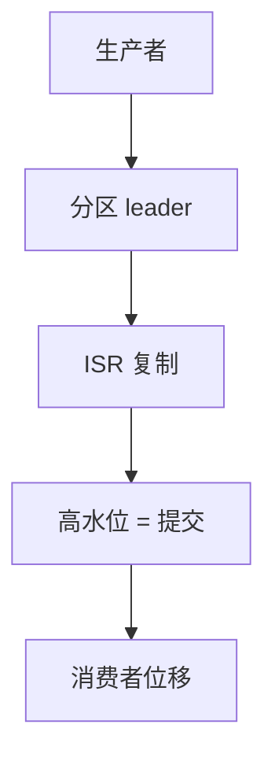

# Kafka 日志

分区是有序、只追加、可多消费者重放的提交日志。ISR 与高水位决定「提交」；位移是消费者的游标，不是全局事务。

<footer>—— 据 Kreps, Narkhede and Rao, Kafka: a Distributed Messaging System for Log Processing, 2011；Apache Kafka 复制设计整理</footer>

上一课[Saga](/cs/saga-pattern)需要事件序与可重放。缺口是**日志作为系统总线**：不是队列「拿走即删」，而是保留、重放、多订阅。本课钉分区日志与副本，不重写补偿。后课 pub-sub 是更一般的模式，Kafka 是一种实现。

## 问题

每个 topic 分多个 partition，每分区总序，跨分区无全序——这是吞吐换序。生产者按键哈希进分区。副本：leader + ISR 跟随者。`acks=all` 等到 ISR 持久才认为提交。高水位：所有 ISR 都有的偏移，消费者只能读到这里，防止读未提交再因领导者切换消失。

缺口：把 Kafka 当 RSM。它复制的是字节日志，不确定性 apply 你的 $\delta$。恰好一次是生产者 id + 事务标记的限定功能，不是任意消费者副作用。

2011 笔记把日志当 Kafka 核心抽象。后续事务、KRaft 去 ZK 是工程演进，本课以日志+ISR 为对象。

## 方法

消费组：一分区同一组内一个消费者，位移提交到内部 topic。重平衡使位移与所有权抖动，重复投递窗口回来——接[投递语义](/cs/delivery-semantics)。保留策略按时间或大小截断，截断后不能当归档真理除非另备。

与链式复制：ISR 是动态集合，提交点是高水位不是固定尾节点，但「未达提交点不可读」同族。

## 机制

领导者切换：新 leader 在 ISR 内，已提交偏移应在。未进 ISR 的落后副本若被误拉成 leader 会丢——故控制器只从 ISR 选。这是[脑裂](/cs/leader-election-split-brain)在日志上的投影。早期控制器依赖 ZK，KRaft 把元数据也变成 Raft 日志。

本课不写 Streams DSL。也不把 WAL 单机日志当 Kafka。

压缩日志（log compaction）按键留最新值：对 changelog 有用，对事件溯源会删历史——选错策略等于丢审计。

## 边界

本课不列全部配置项。不引入 Pulsar 分层存储全文。后课默认：要分区内全序重放用日志；要全局线性一致对象仍用 etcd/RSM。发布订阅下一课把「多消费者独立游标」说成模式。

日志是存储，位移是消费。提交点在 ISR，不在消费者 ack。

## 小结

- 分区只追加有序；跨分区无全序。
- 高水位/ISR 定义提交；消费者读提交前缀。
- 位移回退 ⇒ 至少一次；业务去重要幂等。
- 出处：Kreps, Narkhede and Rao, 2011；Kafka 复制设计。
