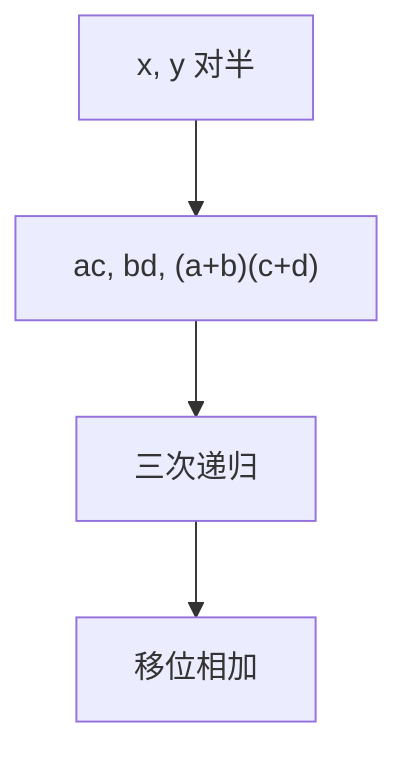

# Karatsuba

把 $n$ 位数拆成两半，三次 $n/2$ 乘代替四次：$T(n)=3T(n/2)+O(n)$，即 $O(n^{\log_2 3})$。

<footer>—— 据 Karatsuba and Ofman, Multiplication of Multidigit Numbers on Automata, 1962；CLRS 第 4、30 章整理</footer>

上一课[高精度算术](/cs/bignum-arith)小学乘 $O(n^2)$。卷积 $xy$ 看似要四块交叉乘。缺口是 Karatsuba：用一次加减换掉一次乘。不重写进位规则。后课 FFT 把次数再降。Toom–Cook 点名。

## 问题

$x=a B^{m}+b$，$y=c B^{m}+d$，$m=n/2$。小学：$ac,ad,bc,bd$ 四次乘。Karatsuba：$p=ac$，$q=bd$，$r=(a+b)(c+d)$，则 $ad+bc=r-p-q$。三次递归乘 + $O(n)$ 加减。主定理 $T(n)=3T(n/2)+O(n)=\Theta(n^{\log_2 3})\approx n^{1.585}$。

缺口是这次代数恒等式，不是 FFT 的单位根。

### 小 $n$ 切回小学

递归到阈值以下用 $O(n^2)$，常数才好看。阈值依机器。不要对 20 位整数硬套三层递归。

Karatsuba 1962（与 Ofman）。Toom–Cook 把拆成 $k$ 段、$2k-1$ 次乘。后课 FFT/Schönhage–Strassen 近线性。

## 方法

对齐偶数位。递归。注意 $a+b$ 可能多一位。符号另行处理，对绝对值乘。

并行三次乘可，本课串行计数。

## 机制

恒等式把交叉项合成一次乘。与[分治](/cs/divide-conquer)同形。正确性是多项式恒等，与基 $B$ 无关。减法可能借位，高精度课已会。

Strassen 矩阵乘是另一恒等式，后课。不要混。

## 边界

本课不写 FFT 乘。负数、模乘可先乘再模。后课默认：大整数乘至少 Karatsuba 阈值策略。下一课 FFT。

## 小结

- 三次半长乘代替四次，$O(n^{1.585})$。
- 小规模切回小学。
- 代数恒等式，不是近似。
- 出处：Karatsuba and Ofman, 1962。
