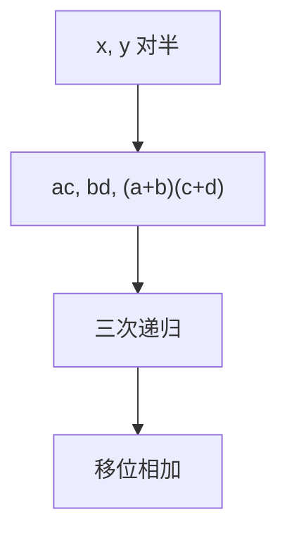
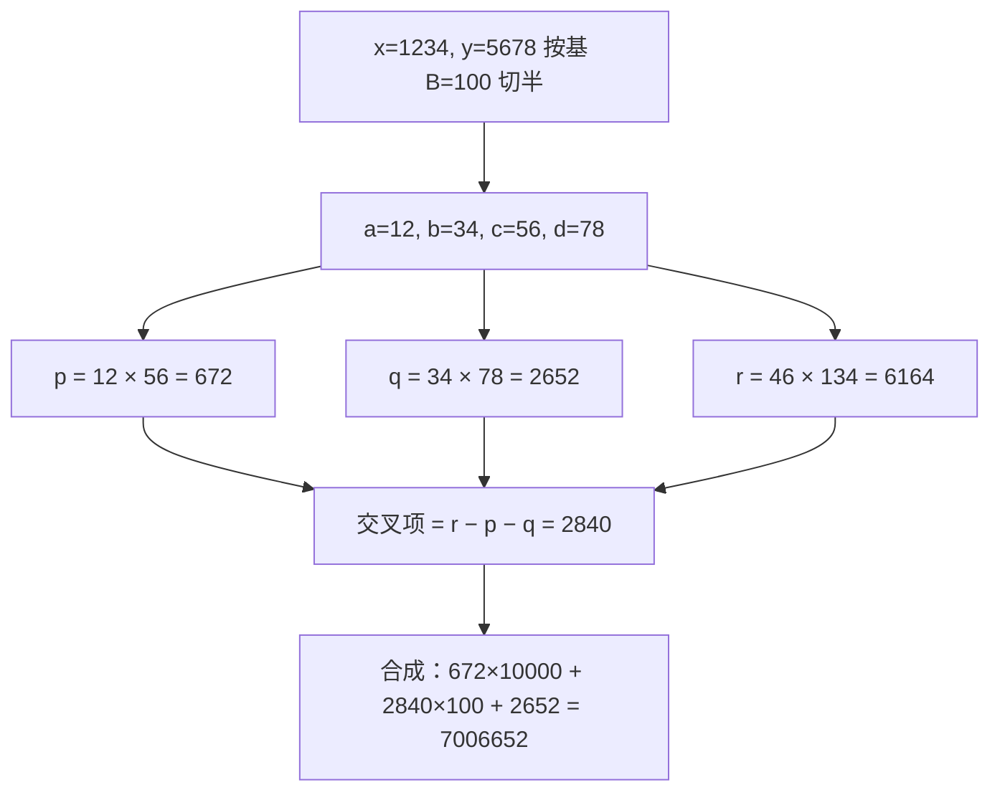

# Karatsuba

把 $n$ 位数拆成两半，三次 $n/2$ 乘代替四次：$T(n)=3T(n/2)+O(n)$，即 $O(n^{\log_2 3})$。

<footer>—— 据 Karatsuba and Ofman, Multiplication of Multidigit Numbers on Automata, 1962；CLRS 第 4、30 章整理</footer>

上一课[高精度算术](/cs/bignum-arith)的小学乘法是 $O(n^2)$：拆成两半后，$xy$ 看似需要四块交叉乘。缺口是 Karatsuba 的观察：用一次加减换掉一次乘。本课不重写进位规则；后课 FFT 把乘法次数再降，Toom–Cook 点名。

## 问题

$x=a B^{m}+b$，$y=c B^{m}+d$，$m=n/2$。小学：$ac,ad,bc,bd$ 四次乘。Karatsuba：$p=ac$，$q=bd$，$r=(a+b)(c+d)$，则 $ad+bc=r-p-q$。三次递归乘 + $O(n)$ 加减。主定理 $T(n)=3T(n/2)+O(n)=\Theta(n^{\log_2 3})\approx n^{1.585}$。

缺口是这次代数恒等式，不是 FFT 的单位根。

### 小 $n$ 切回小学

递归到阈值以下要切回 $O(n^2)$ 小学乘，常数项才好看——Karatsuba 的渐进优势要等 $n$ 越过阈值，阈值随机器与实现而定，典型几十个机器字。不要对二十位的整数硬套三层递归。

数字实例：阈值取 32 个机器字时，一个 1024 字的数要递归五层（1024→512→256→128→64→32），乘法数 $3^5=243$ 次、每次约 $32^2$ 个字乘，合计约 24.9 万；小学乘法则要 $1024^2 \approx 105$ 万次——差四倍多。

Karatsuba 1962（与 Ofman）。Toom–Cook 把拆成 $k$ 段、$2k-1$ 次乘。后课 FFT/Schönhage–Strassen 近线性。

## 方法

实现顺序：先把位数对齐成偶数、从中间切开；跑三次递归乘；合成时注意 $a+b$、$c+d$ 可能比半长多一位，中间积多留一位；符号单独记录，核心只对绝对值相乘。

```mermaid
flowchart TD
  XY["x, y 对半"] --> P["ac, bd, (a+b)(c+d)"]
  P --> REC["三次递归"]
  REC --> COMB["移位相加"]
```

三次递归乘彼此独立，可以并行；本课按串行计账。

## 机制

机制就是那一条恒等式：交叉项 $ad+bc$ 不必分开乘，$r-p-q$ 一次合成，乘法数从四降到三，主定理随即把指数从 $2$ 压到 $\log_2 3$。它与[分治](/cs/divide-conquer)同形。正确性是多项式恒等——把 $x,y$ 看成基 $B$ 的多项式后逐点成立，与 $B$ 取什么值无关。减法可能借位，高精度课已会处理。

直觉类比：$(a+b)(c+d)$ 是把四种配对「一锅端」全乘一遍；减掉两个纯项 $ac$、$bd$，锅里剩下的恰好是交叉项。本质是用加减法（便宜）换掉一次大乘法（贵）。

```mermaid
flowchart TD
  S["x=1234, y=5678 按基 B=100 切半"] --> A1["a=12, b=34, c=56, d=78"]
  A1 --> P["p = 12 × 56 = 672"]
  A1 --> Q["q = 34 × 78 = 2652"]
  A1 --> R["r = 46 × 134 = 6164"]
  P --> C["交叉项 = r − p − q = 2840"]
  Q --> C
  R --> C
  C --> F["合成：672×10000 + 2840×100 + 2652 = 7006652"]
```

Strassen 的矩阵乘是同一思想的另一恒等式（七乘代八乘），后课展开，不要与本课混。

## 边界

本课不写 FFT 乘法。负数与模乘都可先乘再处理。后课默认：大整数库至少要有 Karatsuba 加阈值切换。下一课 FFT。

常见误区：以为渐进更优就能到处用。实际上 $n$ 低于阈值时，递归与加减的开销反而拖慢速度——GMP 这类库都是混合策略：小数用小学乘，中数用 Karatsuba，更大才上 Toom–Cook 与 FFT。

## 小结

- 三次半长乘代替四次，$O(n^{1.585})$。
- 小规模切回小学。
- 代数恒等式，不是近似。
- 出处：Karatsuba and Ofman, 1962。
