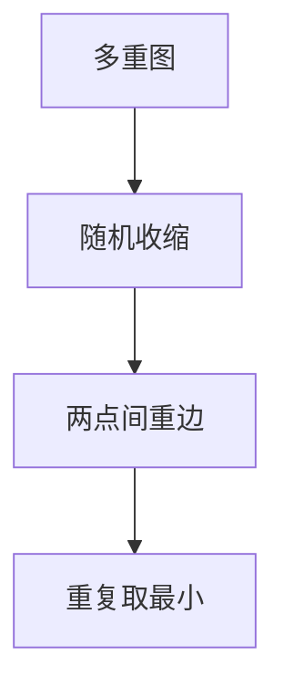

# Karger 最小割

随机收缩边直到两点，得到的割以 $\Omega(1/n^2)$ 概率为全局最小；重复 $O(n^2\log n)$ 次高概率成功。

<footer>—— 据 Karger, Global Min-cuts in RNC, 1993；Karger and Stein, 1996；CLRS 第 23 章对照整理</footer>

上一课[几何精度](/cs/geometric-robustness)收束几何。主干[最大流最小割](/cs/max-flow-ff)是 $s$–$t$ 割。全局最小割：无指定 $s,t$，无向边连通性。缺口是 Karger 随机收缩。不重写 Dinic。后课 Las Vegas / Monte Carlo 分类。

## 问题

无向（多重）图。收缩边：两端合并，环丢掉。直到剩 2 顶点，其间重边为割。最小割边数 $c$，成功概率 $\ge 1/\binom{n}{2}$ 量级：每次收缩不碰最小割边的条件概率。Karger–Stein：递归到 $n/\sqrt 2$ 再分支，时间更好。

缺口是随机收缩，不是 $n$ 次最大流（也可 $O(n)$ 次流，更重）。

### 不是 $s$–$t$ 最小割

全局割可小于某对 $s$–$t$。指定 $s,t$ 用流。本课全局。

Karger 1993。Karger–Stein 1996。后课把成功概率收进 Monte Carlo 定义。

## 方法

实现用并查集 + 随机边（按重边权或邻接表）。重复独立试验取最小。Karger–Stein 递归写清分支。

加权边：按权随机，或先离散。

## 机制

最小割边少，随机边更常落在块内。分析用 $\prod (1-c/(m_i))$。与最大流：确定多项式，常数大。Karger 简单、随机。与 Borůvka：都收缩，一个为 MST 最轻、一个为均匀随机。

## 边界

本课不写近线性确定全局最小割的最新结果全文。有向全局割不同。后课默认：全局最小割可用随机收缩。下一课 Las Vegas 与 Monte Carlo。

## 小结

- 随机收缩以多项式分之一得到最小割。
- 重复放大成功概率。
- 全局，不是 $s$–$t$。
- 出处：Karger, 1993；Karger and Stein, 1996。
