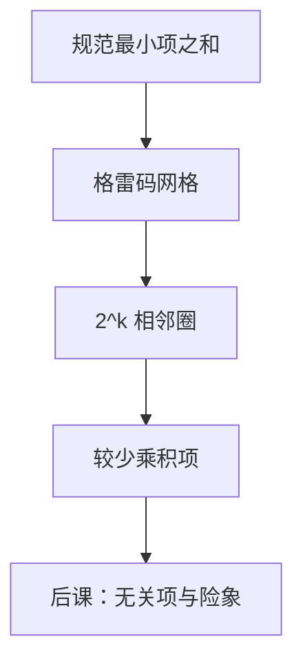

# 卡诺图与化简

相邻的最小项只差一个变量，圈在一起就能消掉那个变量；图把相邻画成格子的邻居。

<footer>—— 据 Karnaugh, The Map Method for Synthesis of Combinational Logic Circuits, 1953；Harris and Harris, Digital Design and Computer Architecture 整理</footer>

上一课[最小项与最大项](/cs/minterm-maxterm)钉死了规范 SOP/POS。本课不重列 $2^n$ 个最小项，也不从「逻辑综合史」另起。缺口是：规范式通常太长。电路要的是更少的门、更短的式，同时**保持 1-集合不变**。

## 问题

$n$ 稍大，规范或项数就是真值表里 1 的个数，没法直接铺门。代数反复用吸收律可以化简，但没有视觉上的「哪些项能合并」。缺口因此不是新的函数类，而是一种排列：把最小项放进格雷码网格，使得几何相邻 $\Leftrightarrow$ 汉明距离 1，于是 $2^k$ 个相邻 1 合成一个消去 $k$ 个变量的乘积项。

卡诺图对 $n\le 4$ 好用，$n=5,6$ 要对折。更大规模交给列表法，本课不展开 Quine–McCluskey。无关项与险象故意留到[下一课](/cs/dont-care-hazard)。

### 圈不是「把所有 1 圈进一个最大圈」

每个 1 必须被至少一个质蕴涵项覆盖；圈要乘 2 的幂、不能斜切。贪心画一个最大圈可能迫使别处补很多小圈。本课只要求：合法圈对应乘积项，覆盖完整。最优覆盖是集合覆盖，图上靠眼力，不是多项式算法。

Karnaugh 1953 把 Veitch 图改成格雷码相邻。Harris 用它当手算综合的主工具。本栏后课的 ALU 控制逻辑，默认已经会从真值表收成几项。

## 方法

画 $2^n$ 格，行、列按格雷码标变量。填 1/0。圈 $1,2,4,8,\ldots$ 个相邻 1（含卷绕相邻）。每个圈读出不变的变量得乘积项，所有圈的或即化简 SOP。对偶可圈 0 得 POS。

## 机制

合并的本质是上一课纠错直觉里的距离：差一位的两个最小项，那个变量成为无关，式子变短。功能集合不变，延迟和面积通常下降——「通常」是因为多级因式分解还能再短，卡诺图只管两级 SOP。后课门时延会说明：两级与或的深度固定，项再少，关键路径仍可能被扇出拖住。

同一函数的 SOP 与 POS 哪个更短，看 1 多还是 0 多。本课两种都合法。

## 边界

本课默认函数完全指定、输入同时到达。竞争与静态险象、以及 $X$ 无关项，下一课才加。也不把 HDL 综合器的算法写成步骤。

后课默认：手算组合逻辑从真值表进卡诺图得到两级式；不完全指定与毛刺另处理。

## 小结

- 卡诺图把汉明距离 1 画成格子相邻，合并即消去变量。
- 圈须为 2 的幂并覆盖全部 1；最短覆盖仍可能要试。
- 只管两级 SOP/POS；多级分解与时序不在本课。
- 出处：Karnaugh, 1953；Harris and Harris。
