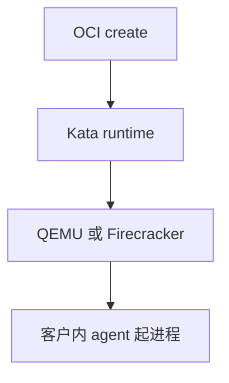

# Kata Containers

Kata 实现 OCI 运行时：每个容器（或 pod）一台 VM，里面再跑常规 Linux，接口仍是 create/start，隔离强度靠近 VM。

<footer>—— 据 Kata 文档；[runc](/cs/container-runtime) 与 [Firecracker](/cs/firecracker-microvm)/QEMU 为后端</footer>

[Firecracker](/cs/firecracker-microvm) 是 VMM。[containerd](/cs/container-runtime) 要 **runtime 插件**。缺口是 Kata：用 VM 冒充容器接口。

## 问题

shim → Kata → QEMU 或 FC → 客户里的 kata-agent 起用户进程。缺口：镜像如何进 VM（block 或 virtio-fs）；网络 [veth](/cs/netns-veth) vs 客户网卡。本课不把 k8s RuntimeClass 写成编排课。

pod 级 VM 摊启动成本。对象是接口兼容 + 内核隔离。

## 方法

containerd 调 Kata 而非 runc。对照 gVisor 也是 runtime 替换。对照 [nested](/cs/nested-virtualization)：Kata 在裸金属最甜。对照 overlay：层可在宿主做成块设备给客户。

## 机制

Kata 让编排系统不改 API 就换隔离模型：失败时仍是「容器」，底层是 VM。税是内存与启动。不要写成安全认证。与 [LSM](/cs/lsm-selinux)：宿主管 VMM，客户另有策略。

文件系统语义（fsync、mmap）依赖 virtio-fs/9p 的实现裂缝。

实现上：virtio-fs 或块设备把镜像送进 VM，语义与宿主 overlay 不完全一样。pod 级 VM 让 pause 容器和业务容器共享一台客户机。RuntimeClass 才切换 runc/kata。 读法上只引用[上一课](/cs/firecracker-microvm)的结论，不把对象换成训练推理或限价簿。

本课在操作系统进阶的「虚拟化与隔离进阶 / 容器与内核形态」课序里，对象是 **Kata Containers**。

- 先修只引用，不重导：上一课的结论当公理，本课只补差。
- 五栏不吞并：不把本课写成大模型训练/推理，也不写成限价簿或权重量化。
- 文献用 OSTEP、McKusick、内核文档与具名会议论文；不发明 arXiv 编号。

## 边界

本课不引入所有 hypervisor 插件。不保证 Windows。下一课更极端：unikernel。

版本字段会变，课序钉的是机制对象「Kata Containers」，不是某一主线内核的结构体名。
后课默认：OCI 可由 VM 实现。把应用与内核链成单一映像，下一课 unikernel。

## 小结

- Kata：OCI 表面，VM 隔离。
- 客户内 agent 才 exec 用户。
- unikernel 是下一课。
- 出处：Kata 文档；OCI；KVM。
