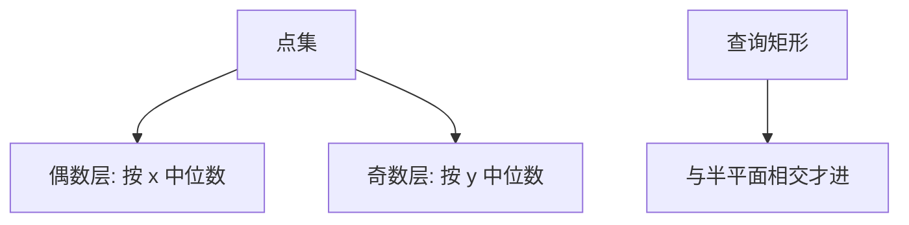
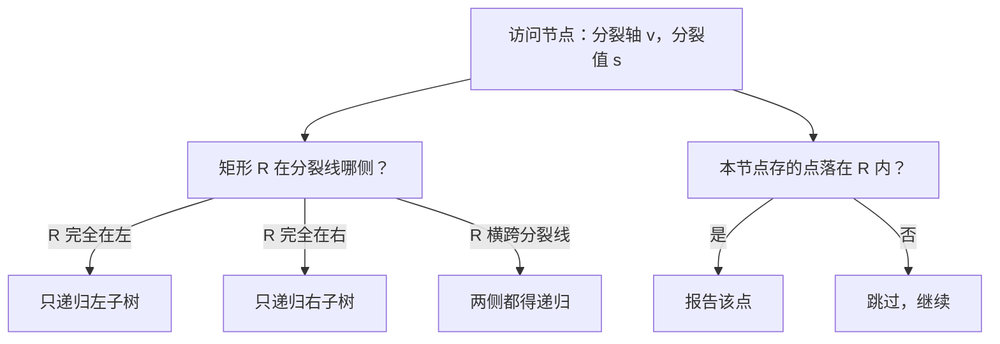

# k-d 树

各层轮换轴，用中位数把点集切开；范围查询在包围盒与查询矩形不相交时剪枝。

<footer>—— 据 Bentley, Multidimensional Binary Search Trees Used for Associative Searching, CACM 1975；Preparata and Shamos 整理</footer>

[上一课](/cs/interval-tree) 在一维区间上剪枝。平面（或 $k$ 维）点集：问矩形里有哪些点，或最近邻。本课不维护 maxR。缺口是 k-d 树：循环选维、按该维坐标 BST 分裂。

## 问题

$n$ 个点在 $\mathbb{R}^k$。正交范围查询。对半按 $x$ 再按 $y$……建树，$\Theta(n\log n)$ 可建（每次找中位数）。节点存点或存分裂值。查询矩形 $R$：当前分裂轴把空间切成两半，与 $R$ 相交的一侧才递归；点在 $R$ 内则报告。缺口是**轴循环的二叉空间划分**，不是 $k$ 叉。

直觉类比：k-d 树像切蛋糕——先竖切一刀（按 x 选居中位置），每块里再横切一刀（按 y），如此交替。每刀都把一块切成两半，查询时只看与「查询窗口」重叠的那几块。

最坏查询可到 $\Theta(n^{1-1/k}+m)$ 一类界（平面约 $\sqrt{n}$），平均更好。不要宣传成永远对数。

Bentley 1975, *CACM*。最近邻沿优先队列扩球，本课点名，不把所有启发式写完。

## 方法

静态：预排序各维或线性时间中位数。动态插入破坏平衡，可定期重建或用替罪羊思想，本课以静态为主。维数 $k$ 大时，近邻与范围剪枝失效（距离集中），这是后课 LSH 的动机，本课只警告。

常见误区：以为维数越高 k-d 树照样神速。实际上 $k{=}50$ 时点与点的距离几乎一样远（距离集中），剪枝条件几乎不成立，查询退化成近似全扫——高维得换 LSH 或近似最近邻索引。

```mermaid
flowchart TD
  P["点集"] --> X["偶数层: 按 x 中位数"]
  P --> Y["奇数层: 按 y 中位数"]
  Q["查询矩形"] --> CLIP["与半平面相交才进"]
```

与四叉树：k-d 每次一轴二分；四叉按中点四块，形状不同。与 R 树：R 树包的是矩形 MBR，面向磁盘页。

## 机制

剪枝正确性：包围盒（由分裂历史推出）与 $R$ 不相交则子树无点。更新一个点可能让树失衡，动态几何更常换 R 树或定期重建。

数字实例：二维、一百万个点，一次最坏矩形查询要碰约 $n^{1-1/2} = \sqrt{n} \approx 1000$ 个节点——而不是 $\log_2 10^6 \approx 20$ 个。「不要宣传成永远对数」说的就是这个差距。

```mermaid
flowchart TD
  N["访问节点：分裂轴 v，分裂值 s"] --> C1["矩形 R 在分裂线哪侧？"]
  C1 -->|"R 完全在左"| L["只递归左子树"]
  C1 -->|"R 完全在右"| RR["只递归右子树"]
  C1 -->|"R 横跨分裂线"| B["两侧都得递归"]
  N --> P["本节点存的点落在 R 内？"]
  P -->|"是"| RE["报告该点"]
  P -->|"否"| SK["跳过，继续"]
```

本课不进入限价簿或金融微观结构；点就是 $\mathbb{R}^k$ 记录。

## 边界

高维、磁盘块、或允许矩形重叠的分页索引：下一课 R 树。k-d 树不是 GIS 默认外存结构。

后课默认：内存静态点集正交查询可用 k-d。外存矩形用 R 树。

## 小结

- k-d 树：轮换轴的多维 BST，范围查询可剪枝。
- 最坏不是 $O(\log n)$；高维退化。
- 外存矩形索引进 R 树。
- 出处：Bentley, *CACM*, 1975；Preparata and Shamos。
