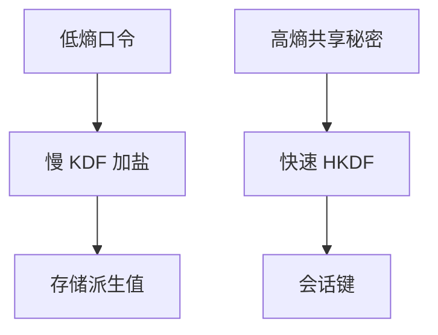

# KDF 与慢哈希

从口令派生密钥必须贵而带盐；普通哈希太快，离线猜测会把低熵秘密一次试完。

<footer>—— 据 PKCS #5 / PBKDF2；Morris and Thompson 对照；Anderson 对慢哈希的整理</footer>

[上一课](/cs/password-salt)规定库里不存原文、要加盐。本课不重讲「盐打破彩虹表」。缺口是速度：SHA 一类摘要按设计很快，这对本课[哈希碰撞](/cs/hash-collision) 的完整性用途是优点，对口令是缺点。KDF 与专门慢哈希把猜测变成算力与内存预算。认证协议下一课。

## 问题

口令课留下慢哈希一词。密钥派生函数（KDF）还有另一用途：从 DH 共享秘密拉出 AEAD 键（HKDF），那要快而均匀。口令 KDF 相反：故意慢、可调迭代、最好抗大规模并行。缺口是**两种 KDF 不要用错场合**。

参数（迭代、内存）随硬件涨。本课不点具体口令破解配置。防御是用为口令设计的函数，并保护哈希库本身。

## 方法

口令：盐 + 慢 KDF，存派生结果。会话：HKDF 从高熵秘密派生，不套用口令参数。升级：算法标识与参数要和哈希一起存，才能迁函数。本课不比较全部函数商品名当选购广告。

## 机制

慢哈希改变的是威胁模型里「抄库之后」的代价，不防止在线猜——在线要靠认证协议的限速与锁定。HKDF 服务[DH 分工](/cs/dh-vs-rsa) 已得到的秘密。两者都不是加密算法本身。

## 边界

本课不引入生物特征模板当口令替代。网上如何证明「此刻是谁」且抗重放，下一课认证协议。

后课默认：口令存储用慢 KDF。交互认证是另一套消息。

## 小结

- 口令派生必须慢且加盐；会话派生要快。
- 抄库后的离线猜测靠代价挡住，不是靠保密算法名。
- 认证协议下一课。
- 出处：PKCS #5；Morris and Thompson；Anderson。
