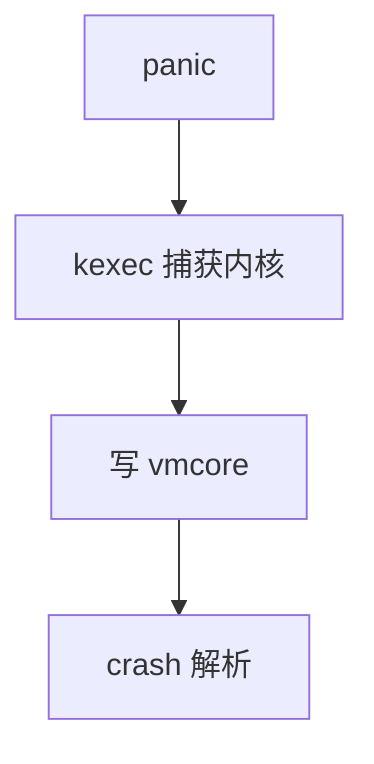

# kdump 与 crash

kdump 用 kexec 进第二内核，把崩溃瞬间的内存当 ram 盘转出；crash 工具在事后解析 vmcore。

<footer>—— 据 Linux kdump 文档；kexec；[printk](/cs/printk-logging) 环可能不够事后分析</footer>

[eBPF](/cs/ebpf-observability) 看活体。机器已经 oops。缺口是 **保留内存 + 第二内核** 抓 dump。

## 问题

崩溃时锁可能死、文件系统可能不可信。kexec 跳到预留的 capture kernel，旧内存只读。缺口：预留大小；加密盘；与 [watchdog]。本课不把 crash 命令当教程全文。

pstore/ramoops 是更小的紧急日志。对象是整机内存镜像，不是 coredump 用户进程——那是另一条。

## 方法

启动预留 crashkernel → panic 时 kexec → 写 vmcore。对照 [hibernate](/cs/suspend-resume)：一个有意写镜像，一个意外。对照 [fsck](/cs/fsck)：dump 后再修盘。对照 makedumpfile 过滤页。

## 机制

kdump 把「死内核的 RAM」变成可分析文件，是生产根因的最后手段。它需要事先预留，不能崩溃后再装。不要写成云监控套餐。与 [KPTI](/cs/kpti-os)：解析要懂页表。

失败：预留不够、设备驱动在第二内核缺失。

实现上：crashkernel= 预留必须在启动时做，崩溃后再留来不及。第二内核驱动要能写盘或网，常用精简 config。过滤掉缓存页可缩小 dump。 读法上只引用[上一课](/cs/ebpf-observability)的结论，不把对象换成训练推理或限价簿。

本课在操作系统进阶的「安全、启动与调试 / 观测与调试」课序里，对象是 **kdump 与 crash**。

- 先修只引用，不重导：上一课的结论当公理，本课只补差。
- 五栏不吞并：不把本课写成大模型训练/推理，也不写成限价簿或权重量化。
- 文献用 OSTEP、McKusick、内核文档与具名会议论文；不发明 arXiv 编号。

## 边界

本课不引入所有过滤策略。不保证虚拟机的 pvpanic 路径。下一课崩溃语义：oops 与 panic。

版本字段会变，课序钉的是机制对象「kdump 与 crash」，不是某一主线内核的结构体名。
后课默认：可 kexec 出 vmcore。oops 与 panic 如何决定活还是死，下一课。

## 小结

- kdump：预留内核 + kexec + vmcore。
- 分析用 crash；依赖事先配置。
- oops/panic 是下一课。
- 出处：kdump；kexec；crash 工具。
