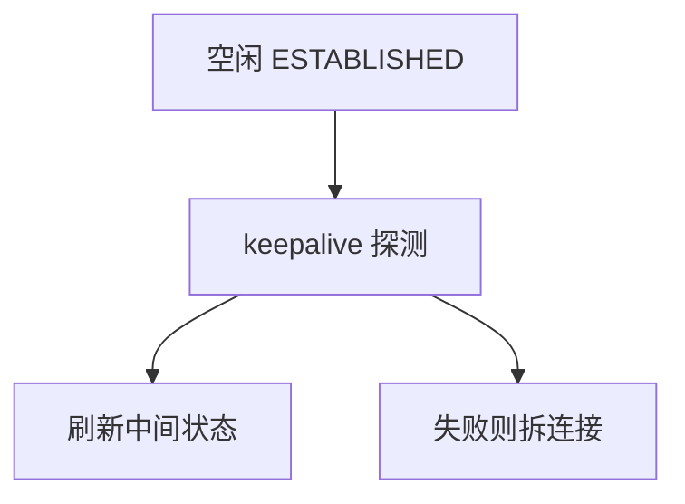

# 保活与半开

对端崩溃或 NAT 超时后，本地仍显示 ESTABLISHED；保活用稀少探测把半开找出来，默认以小时计，不是心跳协议。

<footer>—— 据 RFC 9293 保活；RFC 1122 主机需求整理</footer>

[状态机](/cs/tcp-state-machine) 可停在 ESTABLISHED。[上一课](/cs/syn-cookies) 管握手泛洪。缺口是**长期半开**：中间 NAT、崩溃、无线切换丢了 RST。本课不把 RTT 公平写完。

## 问题

TCP 无数据则无包，防火墙/NAT 会话超时后黑洞，两端还以为连接在。Keepalive：空闲超过阈值发探测 ACK/包，失败则错误给应用。默认 2 小时量级，对交互应用太慢，故应用层心跳后课。探测可被中间当成流量重置计时——副作用。SO_KEEPALIVE 是套接字选项，不是 HTTP 的 keepalive。

不要把保活写成拥塞探测。

RFC 1122 说保活可选且应能关。移动网络更短的 NAT 超时迫使应用心跳。本课钉传输层。

### 默认以小时计

不是 HTTP keepalive。交互应用应自管心跳。探测可刷新 NAT，也会阻止休眠。TIME_WAIT 不要用保活「修」。

## 方法

对照：TCP keepalive vs 应用 ping vs QUIC PING 帧。画：空闲 → 探测 → 无应答则关闭。与 LLDP TTL 老化同类：软状态需要刷新。

方法止于选定对象与对照；机制才说它如何嵌入已有分层与主干课。

## 机制

半开浪费 TCB 与 NAT 槽。RST 若走过仍能立刻拆；保活是 RST 丢失时的底。卫星贵流量，不宜高频探测。RoCE QP 有自己的超时。状态 TIME_WAIT 不是半开，不要用保活「修」。

与端到端：只有应用知道「会话是否还有意义」，传输保活只知对端栈是否应答。

## 边界

本课不引入 TCP_USER_TIMEOUT 的全部。RTT 不公平是下一课。后课默认：TCP keepalive 慢且可选；短超时用应用心跳。

在电池设备上保活会阻止休眠。

上一课留下的缺口在本课收口；「保活与半开」进入后课词汇表后只引用。文献用来钉对象与边界，不把本课写成该主题的独立综述。下一课[RTT 不公平](/cs/cc-fairness-rtt)。

## 小结

- 半开：状态还在，路已断。
- 传输保活以小时计，刷新 NAT。
- 交互应用应自管心跳。
- 后课只引用本课钉死的对象，不从该领域总问题重开。
- 出处：RFC 9293；RFC 1122。
