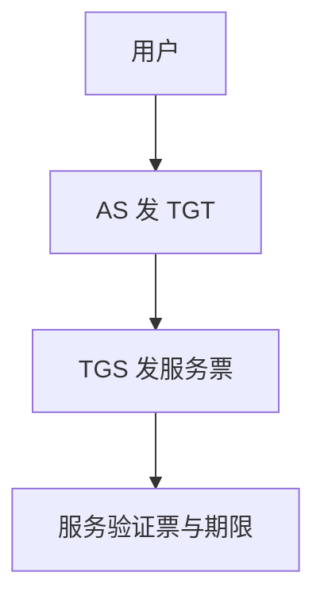

# Kerberos 直觉

用密钥分发中心发有时限的票据：一次登录，向许多服务证明自己，而不把长期口令送给每一台服务器。

<footer>—— 据 Needham–Schroeder；MIT Kerberos；Stallings；RFC 4120 对照</footer>

[上一课](/cs/auth-protocol)抽出挑战–响应与抗重放。本课不重做「认证不是加密」。缺口是域内单点：许多服务器共享用户口令会扩大泄露面。Kerberos：可信 KDC 发票据与会话键，服务只验证票。OAuth 下一课是互联网上的委托，对象不同。

## 问题

认证协议课留下通用消息。局域网要 SSO。Needham–Schroeder 对称方案的时间戳/nonce 修补通向 Kerberos：AS 用长期密钥（常从口令派生）交出 TGT；TGS 用 TGT 发服务票。服务票含会话键与名字、期限。缺口是**票据作为能力的直觉**，不是把报文格式背完。

时钟同步是 Kerberos 的著名假设：期限与防重放靠时间窗。KDC 是单点信任与单点故障。本课不给伪造票步骤。

## 方法

登录：用户向 AS 证明，得 TGT。访问服务：持 TGT 向 TGS 要服务票，再向服务出示。服务用自己与 KDC 的共享键打开票。后课能力对 ACL 会对照「持票即允许」。TLS 不替代域内这套，对象是浏览器与网站时另一套。

## 机制

长期秘密只在用户与 KDC、服务与 KDC 之间；服务不存用户口令。这缩小泄露面，并把[最小特权](/cs/acl-least-priv) 做成有期限的会话键。DY 敌手无 KDC 密钥则不能铸造合法票。时钟与重放窗口是模型的一部分。

## 边界

本课不把跨域信任传递的全部 krbtgt 故事写进主干。浏览器委托第三方访问 API，下一课 OAuth/OIDC。

后课默认：域内票据是一种认证。开放 Web 上的授权委托是另一协议族。

## 小结

- Kerberos：KDC 发有时限票据与会话键。
- 服务不收用户长期口令。
- OAuth/OIDC 下一课。
- 出处：Needham–Schroeder；Stallings；RFC 4120。
