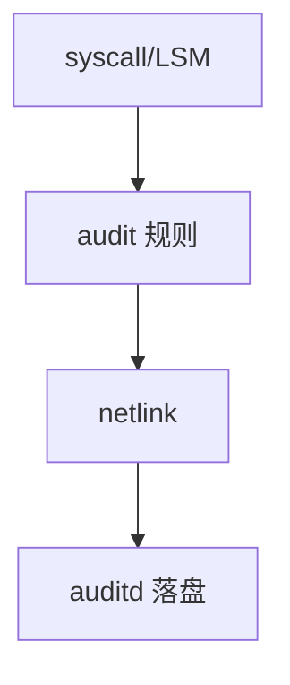

# auditd

audit 子系统在钩子上生成记录：谁、何时、哪个系统调用、成功与否；auditd 在用户态写盘并轮转。

<footer>—— 据 Linux audit 文档；[LSM](/cs/lsm-selinux) 拒绝路径；McKusick 对安全日志的背景</footer>

[SELinux](/cs/lsm-selinux)/[AppArmor](/cs/apparmor) 的拒绝需要 **可问责**。缺口是内核 audit + auditd，不是 syslog 的全部。

## 问题

规则：监视 `open` 某文件、cap 使用、exec。内核 `kauditd` 把记录送给用户 netlink。缺口：规则过多则 CPU 与丢事件；与 [inotify](/cs/inotify) 不同——audit 是安全审计不是 IDE 热重载。本课不把每条 syscall 字段当作业。

immutable 标志可锁规则直到重启。容器要小心宿主机审计范围。

## 方法

`auditctl` 下规则 → 系统调用返回路径发包 → auditd 写 `/var/log/audit`。对照 [fsnotify]：一个给桌面，一个给合规。对照 [netfilter](/cs/netfilter-conntrack) 日志：对象不同。对照 printk 后课：dmesg 不是审计。

## 机制

audit 把内核决策变成不可轻易抵赖的序列（在磁盘与权限保护下）。它不阻止攻击，只留下痕迹。不要写成 SIEM 产品。与 [fsync](/cs/fsync)：日志完整性依赖刷盘策略。

洪水：攻击者可用事件灌满，规则设计要有上限意识。

实现上：规则用 syscall 号和字段过滤，架构不同号不同。kauditd 拥塞会丢，不是可靠队列。immutable 后改规则要重启。 读法上只引用[上一课](/cs/apparmor)的结论，不把对象换成训练推理或限价簿。

本课在操作系统进阶的「安全、启动与调试 / 内核安全与启动」课序里，对象是 **auditd**。

- 先修只引用，不重导：上一课的结论当公理，本课只补差。
- 五栏不吞并：不把本课写成大模型训练/推理，也不写成限价簿或权重量化。
- 文献用 OSTEP、McKusick、内核文档与具名会议论文；不发明 arXiv 编号。

## 边界

本课不引入所有 arch 特定字段。不保证网络启动早期的 audit。下一课启动链：安全启动与签名。

版本字段会变，课序钉的是机制对象「auditd」，不是某一主线内核的结构体名。
后课默认：特权与 MAC 决策可被审计。固件验证内核签名，下一课安全启动。

## 小结

- audit 在内核生成事件，auditd 落盘。
- 与 inotify 目标不同；过量规则会丢。
- 安全启动是下一课。
- 出处：Linux audit；auditd；LSM。
