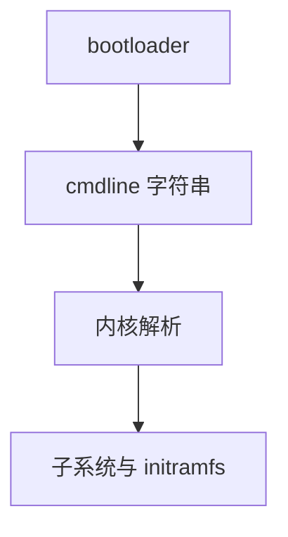

# 内核命令行

启动加载器把字符串交给内核：根设备、console、[KPTI](/cs/kpti-os) 开关、init=，解析发生在 PID 1 之前。

<footer>—— 据 Linux kernel-parameters 文档；[initramfs](/cs/initramfs-pivot) 为根设备先修</footer>

[systemd](/cs/systemd-units) 读自己的配置。更早： **cmdline** 已决定根、调试、隔离。缺口是参数如何进 `initramfs` 与内核子系统。

## 问题

`root=`、`ro`、`quiet`、`isolcpus`、`mem=`。未知参数可留给用户态。缺口：安全——恶意 cmdline 改 `init=`；度量启动要把 cmdline 进 PCR。本课不把全部参数当词典。

模块参数可 `modprobe.blacklist`。与 sysctl 的分工：cmdline 更早、一次性。

## 方法

bootloader 填 `boot_params` → 内核 parse → 子系统注册回调。对照 [cpufreq](/cs/cpufreq-governor)：可 `intel_pstate=disable`。对照 [netns](/cs/netns-veth)：太早无 ns。对照 Secure Boot：签名不含 cmdline 内容，故 PCR 要量它。

## 机制

cmdline 是内核的早期配置 ABI，把硬件与调试开关从编译里解放。它也是攻击面。不要写成 grub 美化。与 [sched_ext](/cs/sched-ext)：可后期加载，不必 cmdline。

发行版在 grub 里拼这串，与用户文档必须一致。

实现上：init= 能换成任意用户态，度量必须覆盖这串。未知参数留给用户态，initramfs 脚本会读。isolcpus 与 nohz_full 常一起出现在 RT 机器。 读法上只引用[上一课](/cs/systemd-units)的结论，不把对象换成训练推理或限价簿。

本课在操作系统进阶的「安全、启动与调试 / 内核安全与启动」课序里，对象是 **内核命令行**。

- 先修只引用，不重导：上一课的结论当公理，本课只补差。
- 五栏不吞并：不把本课写成大模型训练/推理，也不写成限价簿或权重量化。
- 文献用 OSTEP、McKusick、内核文档与具名会议论文；不发明 arXiv 编号。

## 边界

本课不引入所有 arch 特定。不保证 kexec 二次启动的参数策略。下一课描述硬件：设备树与 ACPI。

版本字段会变，课序钉的是机制对象「内核命令行」，不是某一主线内核的结构体名。
后课默认：早期行为可由 cmdline 固定。如何枚举设备，下一课 DT/ACPI。

## 小结

- cmdline 在 PID 1 前配置内核与根。
- 应纳入度量；内容本身通常不在内核签名里。
- 设备树与 ACPI 是下一课。
- 出处：kernel-parameters.txt；boot protocol。
