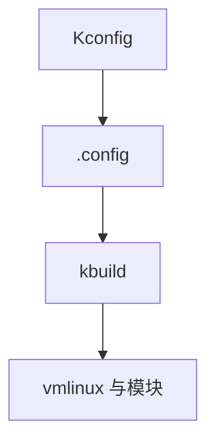

# 内核配置与编译

Kconfig 决定哪些子系统编进内核或模块；.config 是构建输入，决定 [PREEMPT_RT](/cs/preempt-rt)、[KPTI](/cs/kpti-os)、调试选项是否存在。

<footer>—— 据 Linux kbuild/Kconfig 文档；[cmdline](/cs/kernel-cmdline) 为运行时对照</footer>

[livepatch](/cs/livepatch) 假定有匹配的二进制。[加固](/cs/kernel-hardening) 是一组 CONFIG。缺口是 **配置与编译**：不是发行版包管理百科。

## 问题

`make menuconfig`：三态 y/m/n。缺口：依赖与 select；localmodconfig；调试 on 则性能与大小变。本课不把全部符号当词典。

发行版提供预置 config。自编译要匹配 gcc 与 ABI——下一课 kABI。对象是构建系统。

## 方法

.config → kbuild 编 vmlinux/modules → 安装 + initramfs。对照 [systemd](/cs/systemd-units)：用户态构建另一套。对照 DT：DTB 可独立于内核镜像。对照 ASan：`CONFIG_KASAN` 是开发配置。

## 机制

Kconfig 把内核变成可裁剪的产品族，使嵌入式与服务器分享源码。错误的 n 会让驱动不存在，表现为 udev 无节点。不要写成编译原理课。与 [EAS](/cs/eas-scheduling)：无 CONFIG 则无该调度。

模块与内建的取舍影响启动与攻击面。

实现上：localmodconfig 按当前已加载模块裁剪，换硬件要重配。DEBUG_INFO 让 vmlinux 巨大但 perf 才好用。发行版 config 是产品选择，不是「完整内核」。 读法上只引用[上一课](/cs/livepatch)的结论，不把对象换成训练推理或限价簿。

本课在操作系统进阶的「安全、启动与调试 / 观测与调试」课序里，对象是 **内核配置与编译**。

- 先修只引用，不重导：上一课的结论当公理，本课只补差。
- 五栏不吞并：不把本课写成大模型训练/推理，也不写成限价簿或权重量化。
- 文献用 OSTEP、McKusick、内核文档与具名会议论文；不发明 arXiv 编号。

## 边界

本课不引入所有交叉编译工具链。不保证 reproducable build 的每一步。下一课加载后的兼容：kABI 与模块签名。

版本字段会变，课序钉的是机制对象「内核配置与编译」，不是某一主线内核的结构体名。
后课默认：功能由 .config 决定。模块 ABI 与签名，下一课。

## 小结

- Kconfig 生成 .config，kbuild 产出内核与模块。
- 调试与加固选项改变二进制。
- kABI 与模块签名是下一课。
- 出处：kbuild；Kconfig；内核 README。
