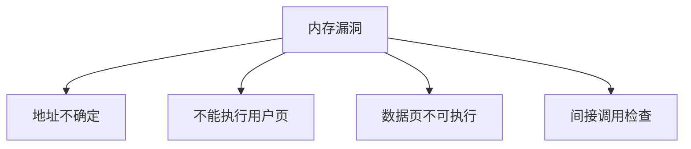

# 内核加固

加固是一组降低利用价值的默认：KASLR、SMEP/SMAP、W^X、栈金丝雀、控制流完整性，而不是一个新的调度器。

<footer>—— 据 Linux kernel self-protection 文档；PaX/grsecurity 的历史直觉；Intel/ARM 对 SMEP/PAN 的说明</footer>

[KPTI](/cs/kpti-os) 是侧信道专项。[capabilities](/cs/linux-capabilities) 在安全课序。缺口是 **内存与控制流加固** 在 OS 的落点：攻击面从「任意读写」变成「还要过这些门」。

## 问题

漏洞仍在。KASLR：内核映像随机。SMEP：用户页不能在内核态执行。SMAP/PAN：内核不能随意碰用户数据，必须显式开关。栈金丝雀：`__stack_chk`。CFI：间接跳转检查。缺口：每一项的性能与调试税；与模块签名后课接头。本课不把 exploit 写成教程，只讲防御机制。

lockdown、seccomp 是策略。本课偏硬件+编译器协助的内存安全。不要写成 LLM 对齐。

## 方法

编译：KASAN 可选（后课 ASan 用户态亲戚）；发布内核开 canary、fortify。运行：CPU 控制寄存器开 SMEP。对照 [LSM](/cs/lsm-selinux)：LSM 是访问控制；加固是利用缓解。对照 [vmalloc](/cs/vmalloc)：执行权限与 W^X 限制可执行 vmalloc。

## 机制

加固把利用链变长、变不稳，使远程代码执行更难。它不修逻辑 bug。不要写成杀毒软件。与 [userfaultfd](/cs/userfaultfd)：加固不禁止合法 uffd。与 DPDK：用户态驱动仍要 IOMMU，那是 DMA 下一课。

调试：KASLR 使 oops 符号要 kallsyms；生产与调试内核配置分裂。

实现上：KASLR 熵受内存布局和模块加载影响，不是密码学密钥。SMAP 在 copy_from_user 路径要 stac/clac。CFI 误报会直接 oops，调试内核有时关。 读法上只引用[上一课](/cs/kpti-os)的结论，不把对象换成训练推理或限价簿。

本课在操作系统进阶的「内存进阶 / 回收、迁移与加固」课序里，对象是 **内核加固**。

- 先修只引用，不重导：上一课的结论当公理，本课只补差。
- 五栏不吞并：不把本课写成大模型训练/推理，也不写成限价簿或权重量化。
- 文献用 OSTEP、McKusick、内核文档与具名会议论文；不发明 arXiv 编号。

## 边界

本课不引入每一项 CONFIG_ 的依赖图。不保证实时内核上 CFI 的延迟。下一课设备 DMA 如何与缓存/IOMMU 一致。

版本字段会变，课序钉的是机制对象「内核加固」，不是某一主线内核的结构体名。
后课默认：内核默认带多层利用缓解。DMA 与一致性，下一课。

## 小结

- 加固：随机化、W^X、SMEP/SMAP、金丝雀、CFI。
- 与 LSM 分工：缓解利用 vs 访问策略。
- DMA 一致性是下一课。
- 出处：KSPP 文档；硬件手册 SMEP；Linux 安全文档。
