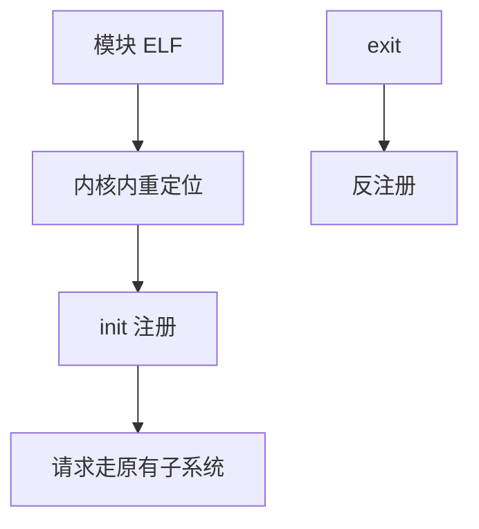

# 内核模块

可加载模块是在运行中链入内核地址空间的目标文件：init 注册驱动，exit 注销，符号必须与正在跑的内核匹配。

<footer>—— 据 Love, Linux Kernel Development；Tanenbaum 对可加载驱动的整理</footer>

[上一课](/cs/tty-pty)的驱动不必全部编进内核镜像。[用户/内核分裂](/cs/user-kernel-split) 里内核代码已在高半。[系统调用](/cs/syscall-path) 不能让用户随便跳进任意内核函数。缺口是 **LKM**：合法的扩展路径，带版本魔数与符号解析，不是任意代码注入教程。

## 问题

若所有驱动静态链接，发行内核巨大，且无法在运行时接新设备。模块：`insmod`/`modprobe` 把 ELF 搬到内核虚地址，解析对 `EXPORT_SYMBOL` 的引用，调 `init`。失败则卸载。缺口：许可、依赖、以及卸载时必须无引用（设备仍打开则拒绝）。本课不写如何绕过签名强制。

vermagic 匹配内核版本与配置。签名模块在安全启动策略下由内核验签。本课只要求有匹配与验签钩子，不给伪造步骤。

## 方法

构建：针对该内核的 headers 编译。加载：系统调用把映像拷入内核，relocate，调 init（注册 tty、块、文件系统类型）。使用：此后走已有 VFS/块/中断路径。卸载：`exit` 反注册，释放 [slab](/cs/slab-allocator) 对象。不要在 init 里失败却留下半注册状态。

## 机制

模块让宏内核在部署上可裁剪：还是同一特权地址空间，不是微内核 IPC。错误的模块能毁掉整机——这是特权的含义，不是邀请实验提权。与用户动态链接对照：[加载](/cs/load-dynlink) 在用户页表；模块在内核页表，无用户可执行权限。

## 边界

本课不引入 livepatch 的全部一致性模型。不把 out-of-tree 驱动的 ABI 稳定性当保证。下一课：已经加载的内核如何把状态导出成文件，供模块与用户查询——proc 与 sysfs。

后课默认：驱动可运行时链入。内核树状状态的文件接口，下一课 sysfs/proc。

## 小结

- 模块在内核地址空间重定位并 init/exit。
- vermagic 与可选签名约束匹配；本课不讲绕过。
- 只读导出内核状态是 sysfs/proc 的缺口。
- 出处：Love, *LKD*；Tanenbaum *MOS*；Linux kbuild 文档。
