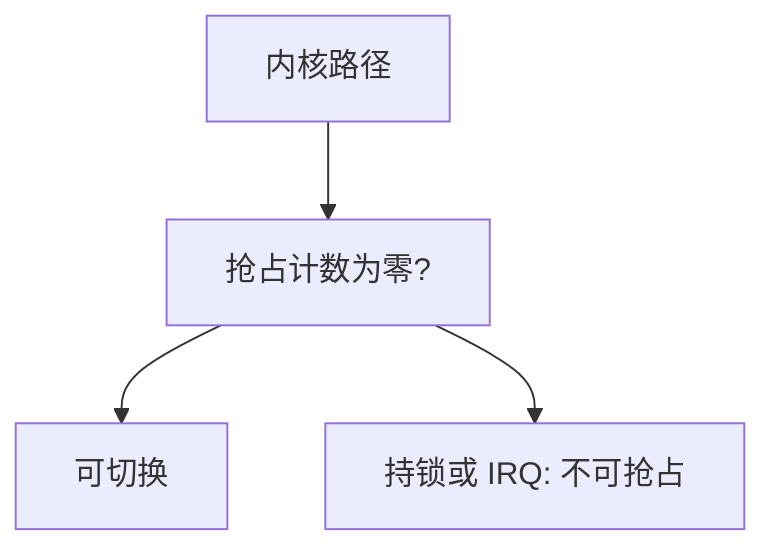

# 内核抢占

若内核在处理系统调用时不可抢占，高优先级线程必须等当前调用主动让出；打开抢占后，调度点遍布内核，锁与 per-CPU 的纪律必须更严。

<footer>—— 据 Love, Linux Kernel Development；Silberschatz et al. 整理</footer>

[上一课](/cs/nmi)说明连关中断都不能挡住一类入口。普通路径上，问题换成另一问：内核正在跑某线程的系统调用时，时钟中断来了，**能不能立刻切到另一条更高优先级的内核/用户线程**。传统 Unix 内核在返回用户前才调度（非抢占内核）；抢占内核在不持有自旋锁、抢占计数为零时允许切换。缺口是这道开关，不是 NMI 栈。

## 问题

非抢占：内核路径一直跑到睡眠或返回用户，实时任务的延迟等于「当前系统调用剩余」。抢占：中断返回内核时若 need_resched 且允许抢占，则[上下文切换](/cs/context-switch)。缺口是：哪些区间禁止抢占——持自旋锁、硬/软中断上下文、显式 `preempt_disable`、以及 NMI。没有计数，抢占会在临界区中间把 per-CPU 假设拆掉。

抢占计数：关抢占、关软中断、在 IRQ 中，都会把计数抬高。为零才是「可在内核中被调度走」。

## 方法

配置打开内核抢占。时钟或唤醒把 `TIF_NEED_RESCHED` 一类位置上。中断返回、或显式 `preempt_enable` 降到零时，检查并调用调度器。睡眠本来就会切换，与抢占无关。驱动在遍历无锁 per-CPU 链表时必须关抢占，否则会被迁到另一 CPU。

本课不把 `PREEMPT_RT` 的全面睡眠锁替换写完，只钉「内核是否可在中途被抢」。

## 机制

抢占把[调度指标](/cs/scheduling-metrics)里的响应从「系统调用边界」推进到「内核内部可抢占点」。代价是：凡假设「不会在这里换线程、换 CPU」的代码都必须显式关抢占。与[中断下半部](/cs/interrupt-bottom-half)叠加：软中断里仍不可睡，但可抢占内核在软中断外更早切换。实时对照课依赖这套点，否则 RM/EDF 只在用户态有效。

## 边界

本课不比较各发行版默认抢占模型，不把锁依赖检测器的全部规则写成正文。用户抢占（时间片用完回到用户再切）一直存在；本课对象是**内核执行途中**被切。

后课默认：可抢占内核里，CPU 本地的无锁数据必须配合关抢占或关中断。如何把数据结构做成每 CPU 一份以避开锁，下一课讲 per-CPU 数据。

## 小结

- 内核抢占：在允许点从内核路径上被调度走。
- 自旋锁、IRQ、显式关抢占禁止切换。
- per-CPU 无锁结构依赖这套计数，下一课展开。
- 出处：Love, *LKD*；Silberschatz et al., *OSC*。
