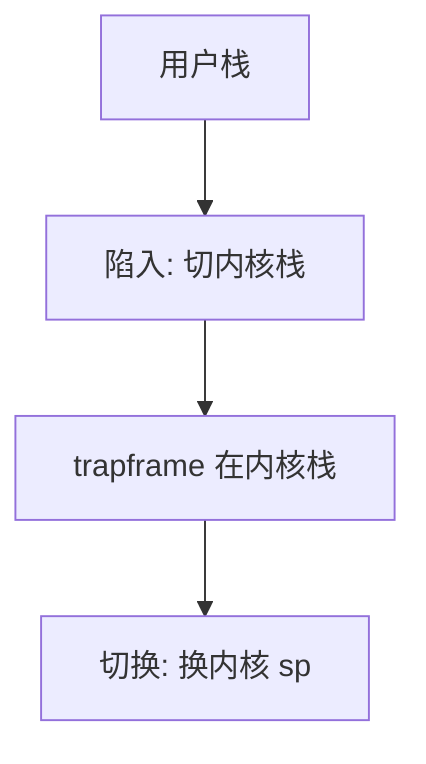

# 内核栈

每条内核线程一份不大的内核栈：陷入、系统调用与中断嵌套都压在这上面，而不是压在用户栈上。

<footer>—— 据 Bovet and Cesati, Understanding the Linux Kernel；Love, LKD 整理</footer>

[上一课](/cs/context-switch)保存用户寄存器并换页表根。硬件在陷入时还会切栈指针到内核。[trapframe](/cs/trapframe) 住在这份栈上。缺口是把**内核栈**说清：为什么不能继续用用户栈、它有多深、溢出意味着什么。本课只钉这份栈，不写 FPU 保存策略。

## 问题

用户栈指针可被用户改成任意值，也可缺页。[特权级](/cs/privilege-rings)下内核若在用户栈上建帧，用户能破坏返回地址。因此每条 `task_struct` 配独立内核栈（页级大小，通常两页量级）。缺口不是 clone 的共享位，而是：切换的核心动作之一是换 `sp` 到下一任务的内核栈，当前帧里的 trapframe 随之换掉。

内核栈小，禁止在内核路径上分配巨大局部数组。深递归与重入中断要靠独立 IRQ 栈或严格嵌套上限。

## 方法

创建任务：分配栈页，把初始栈顶写成「返回到用户或内核线程入口」的伪造帧。陷入：硬件或入口汇编切到该栈，压 trapframe，C 代码在此上继续。中断可在已处于内核时嵌套，继续压同一内核栈，或切到 per-CPU IRQ 栈以免溢。切换：保存当前内核 `sp` 到 PCB，载入下一任务的 `sp`。

[NMI](/cs/nmi) 常用专用栈，避免在已损坏的任务内核栈上再跑看门狗。

## 机制

内核栈把内核执行与用户可写内存切开。同一 CPU 上瞬时只有一个内核 `sp` 活着；其余任务的栈是内存里的冷数据。溢出覆盖相邻的 `thread_info` 或金丝雀，内核必须检测而不能当成普通缺页——内核栈通常不按需扩展。这与用户栈增长是不同政策。

系统调用深度、持锁时的函数图，都受这几页限制；因此下半部才要短。

## 边界

本课不把各架构栈大小的 Kconfig 列完，不讨论 eBPF 在内核栈上的验证。用户态协程的栈是用户页，与本课对象不同。FPU 上下文常常太大，不宜每次都压进这几页，下一课惰性保存。

后课默认：内核执行在任务的内核栈上。浮点/向量寄存器是否每次切换都存，下一课讲 FPU 惰性保存。

## 小结

- 每任务一份内核栈；陷入不使用用户栈。
- 切换换内核 sp；栈小，禁止内核深递归。
- 大块 FPU 状态要惰性处理，下一课。
- 出处：Bovet and Cesati；Love, *LKD*。
