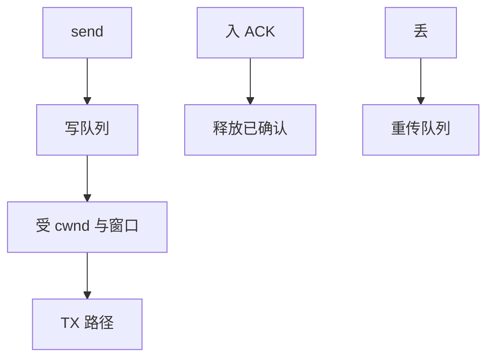

# 内核 TCP 实现要点

内核 TCP 是套接字上的状态机：发送队列、重传定时器、SACK 块、拥塞窗口与 ACK 处理，全部围着 sk_buff 转。

<footer>—— 据 RFC 9293；Linux tcp 实现文档；Stevens, <em>TCP/IP Illustrated</em></footer>

[上一课](/cs/socket-buffers)给了窗口的内存来源。主干网络课若已有拥塞直觉，本课 **不重导 AIMD**。缺口是 OS 落点：哪些队列、哪些定时器、与 [GSO](/cs/gro-gso) 如何接头。

## 问题

`tcp_write_xmit` 按 cwnd 与窗口从 `sk_write_queue` 取 skb。丢失：RTO 或快速重传，SACK 决定重发哪段。时间：RACK 等新路径仍是「估计 RTT、何时断定丢」。缺口：TIME_WAIT、listen 的 SYN 队列与 accept 队列满；小包延迟 ACK 与 Nagle（`TCP_NODELAY`）。本课不把 BBR 公式展开成论文复述。

tcp_mem 是全机 TCP 内存压力，与单 sk 的 sndbuf 分层。MD5 签名、AO 是安全附件，不是主路径。

## 方法

建立：三次握手，TFO 可选。数据：推 skb，设 RTO，进 qdisc。ACK：删已确认 skb，开窗，cong. 信号。对照 UDP：无这些队列。对照 [fsync](/cs/fsync)：TCP 的「完成」是 ACK，不是介质。对照存储 barrier：这里没有 FUA，只有对端状态。

## 机制

内核把 RFC 状态机编成 per-sock 数据，使「可靠字节流」成为系统调用。性能旋钮（窗口缩放、SACK、TSO）都是这个状态机的输入。不要写成 LLM 课的序列模型。与 [NFS](/cs/nfs-semantics)：NFS 可跑在 TCP 上，语义裂缝仍在 NFS，不在 TCP 可靠性。

监听：SYN flood 用 syncookies 换状态，是安全与资源的折中。

实现上：RACK 用时间而不是重复 ACK 计数判断丢包。listen 的 accept 队列满则握手完成的连接被丢，应用看见的是客户端超时。TIME_WAIT 占用端口，高连接周转要 tw reuse 一类旋钮。 读法上只引用[上一课](/cs/socket-buffers)的结论，不把对象换成训练推理或限价簿。

本课在操作系统进阶的「网络栈 / 收发路径」课序里，对象是 **内核 TCP 实现要点**。

- 先修只引用，不重导：上一课的结论当公理，本课只补差。
- 五栏不吞并：不把本课写成大模型训练/推理，也不写成限价簿或权重量化。
- 文献用 OSTEP、McKusick、内核文档与具名会议论文；不发明 arXiv 编号。

## 边界

本课不引入 MPTCP 子流的全部。不保证用户态 TCP（TCP 旁路）与内核状态互通。下一课在 IP 层旁路插入过滤与连接跟踪：netfilter。

版本字段会变，课序钉的是机制对象「内核 TCP 实现要点」，不是某一主线内核的结构体名。
后课默认：TCP 靠写队列、ACK 与定时器实现可靠。包过滤与 conntrack，下一课。

## 小结

- 内核 TCP：写队列、重传、窗口、拥塞控制接在 sock 上。
- 握手队列与 TIME_WAIT 是资源对象。
- netfilter 是下一课。
- 出处：RFC 9293；Stevens *T/IP Illustrated*；Linux net/ipv4/tcp*.c 文档。
