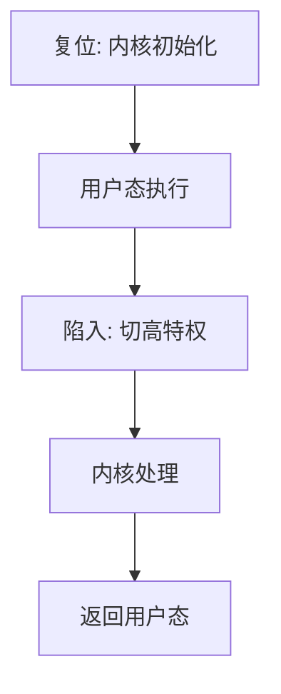

# 内核与用户态

操作系统是一直运行着的程序，它控制着应用程序，并充当计算机与应用程序之间的中介。

<footer>—— 据 Silberschatz, Galvin and Gagne, Operating System Concepts 整理</footer>

[上一课](/cs/exception-table)把语言运行时的异常落到表上的落地信息；编译课到此结束。[特权级](/cs/privilege-rings)和[异常与中断入口](/cs/exception-interrupt-entry)已经给出环与陷入；[分页](/cs/paging-vm)和 [TLB](/cs/tlb-translate)已经能把虚地址译成物理页。本课不重讲页表，也不重做 GC。缺口是：ISA 有环和陷阱，还没有命名**哪一段程序拥有这台机器**。操作系统课从这里开始。

## 问题

用户程序可以算、可以申请堆，但它不能直接改页表根、不能关中断、不能对磁盘端口乱写。若所有代码同一特权，一个越界存储就能毁掉调度器和文件系统。缺口不是再发明一套译址硬件，而是把软件切成两半：**内核**常驻高特权，**用户态**跑在低特权；越过边界只能走陷入。

本课只钉这道门。进程映像、系统调用路径、调度，都是后课在门的两侧展开的对象。

Tanenbaum 把内核定义为处理中断与陷入、操纵硬件的那一层。用户态看不到端口与页表；它看见的是后课才命名的系统调用。

## 方法

约定：复位后先进入内核，建立页表、中断向量、设备。此后用户程序以低特权运行；需要服务时执行陷入指令，硬件切到内核入口——入口约定沿用组成课，不重写。内核做完再返回用户 PC 与栈。

内核映射通常对用户不可写；用户页对内核可见，这是后课系统调用拷贝参数的前提，本课只要求两边地址空间策略不同。

## 机制

有了内核/用户，错误被关在用户页里：缺页、非法指令、越权访问都进同一套入口，由内核决定杀进程还是补页。运行时的 GC 仍在用户堆上工作；它不能自己改 CR3。需要新物理页时，必须请内核。

内核不是「又一个运行时」。GC 管的是语言对象图；内核管的是 CPU、内存和设备的所有权。两者可以共存：托管语言的运行时是用户态程序，底下仍是这道特权门。

## 边界

本课不把微内核与宏内核的模块切分写完，也不列出 Linux 的 `syscall` 表。不重导页表项的有效位与权限位：那是分页课的对象，本课只使用「用户页不可执行特权指令」。也不把隔离当成安全课的沙箱；沙箱是更后的策略。

后课默认：谈到「谁在跑」，先问特权。用户程序默认没有设备与页表的写权限；要服务，就陷入。下一课给出被内核切换的那份**进程映像**。

## 小结

- ISA 已有环与陷入；本课命名内核为拥有机器的程序，用户态为被它中介的程序。
- 越过边界只能走陷阱；GC 仍在用户堆上，不能改页表。
- 进程、系统调用、中断下半部都是后课缺口。
- 出处：Silberschatz et al., *OSC*；Tanenbaum and Bos, *Modern Operating Systems*。
