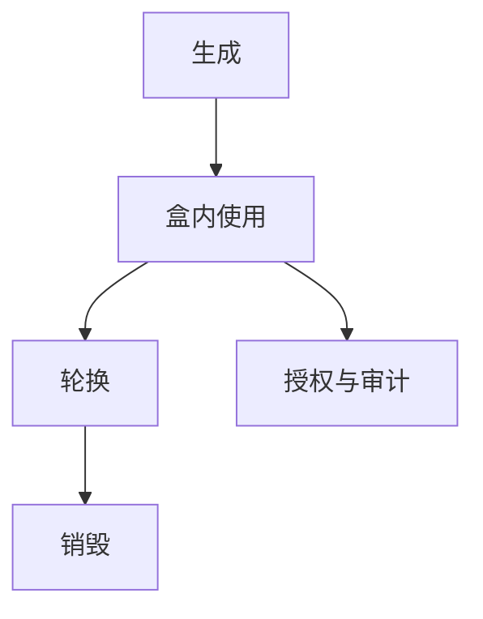

# 密钥管理与 HSM

算法正确只覆盖「运算」；密钥的生成、存放、使用、轮换、销毁才覆盖生命周期。HSM 把私钥关进盒子，让「算而不出」成为策略，而不是再加长 AES。

<footer>—— 据 NIST SP 800-57；Anderson 对密钥生命周期；对照 PKCS #11 的角色分工</footer>

## 定位

上一课[HKDF](/cs/hkdf)会派生多把键。缺口是**这些比特住在哪**。原语课序在 HKDF 结束；本课序从生命周期起。不重写 PRF 定义。

后课默认已经读完本课钉下的合同，只补差，不从该领域第一性原理重开。

## 问题

软件密钥在进程内存、交换分区、日志、快照里复制。威胁模型若含内存读取，AEAD 帮不上。HSM/TEE 提供：键不导出、使用要授权、审计。缺口是管理平面，不是又一种分组密码。

### HSM 不是魔法

盒子固件、管理卡、备份密钥、提权路径仍是 TCB。Anderson：多数事故是流程，不是因式分解。

SP 800-57 分密钥类型与周期。PKCS #11 是常见 API 形状。后课 seL4 从微内核验证谈 TCB；本课只把 HSM 当密钥的引用监视器。

## 方法

列出状态机：生成/注入、激活、轮换、吊销、销毁。对照软件 KMS 与硬件。签名与解密在盒内完成，主机只见明文业务数据或密文。备份用拆分或封装钥。

图中节点是本课的机制骨架；课程不把图展开成可运行的攻击步骤。

## 机制

最小特权落到键：谁能调用 Sign。前向保密下一课问会话键是否短命——HSM 管长期根，不自动让会话遗忘。二者要一起设计。

前提写进合同之后，游戏外的误用只当失败模式点名，不在本课写成操作程序。

## 边界

本课不写某厂商的管理口令默认值清单当利用手册。下一课前向保密：长期根泄漏后历史会话是否仍保密。

## 小结

- HKDF 产出键；本课管键的住处与谁能用。
- HSM 让私钥不可导出成为策略。
- 生命周期失败比算法过时更常见。
- 下一课：前向保密与短命会话键。
- 出处：NIST SP 800-57；Anderson, *Security Engineering*；PKCS #11。
