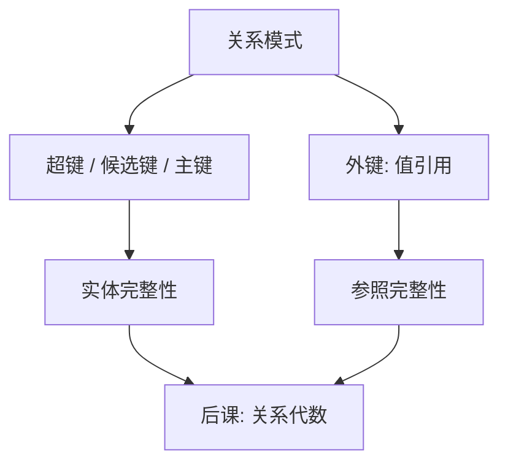

# 键与完整性

键把元组从集合里可识别出来；外键把引用从指针改成值上的约束。

<footer>—— 据 Codd 1970；Date, An Introduction to Database Systems 整理</footer>

[上一课](/cs/er-to-rel)把事实命名成关系：属性上的元组集合，连接靠值相等。本课不重讲域与模式。缺口是：集合里的元组如何被唯一指称，以及一个关系里的值如何合法地指向另一个关系里的元组。没有这两条，更新会留下重复身份和悬挂引用，后课代数只是在脏数据上做闭包。

## 问题

关系是集合，本来没有重复元组。实践里同一实体可以出现两次，只因少了一个能区分身份的属性子集。超键是能函数决定全部属性的属性集；候选键是极小超键；主键是被指定的那个候选键。缺口不是「主键按钮」，而是：**身份必须是值上的约束**，不能靠文件偏移。

外键是另一关系候选键的引用。参照完整性要求：外键为空（若允许）或等于被参照关系中已存在的键值。删除或更新被参照元组时，拒绝、级联或置空是策略，不是完整性的定义。实体完整性：主键属性不空——否则「这一行是谁」没有答案。

函数依赖 $X\to Y$：任何两元组若在 $X$ 上相等，则在 $Y$ 上相等。键是能决定全部属性的 $X$。范式课才系统用依赖，本课只用它定义键。

## 方法

在模式上声明候选键与外键，作为所有实例必须满足的断言。检查发生在插入、删除、更新的边界，而不是查询时事后过滤。声明是逻辑的：物理上可以用[B 树](/cs/btree-external)做唯一索引，那是后课存储的实现，不是完整性的含义。

用户定义的检查（域约束、CHECK）同属完整性，本课不枚举。Codd 把完整性与数据独立性绑在一起：约束写在模式上，应用不必在每条更新路径手写同一段检查。

## 机制

有了键，元组有了稳定身份：复制、更新、删除可以指向「这个键值」，而不指向「现在的第 7 个槽」。有了外键，连接条件常常就是外键等于主键；悬挂引用被拒绝，连接不会默默丢语义。后课规范化会问键是否「太小或太大」；本课只要求键存在且被声明。

多属性键合法。替代键（UNIQUE）与主键同一机制，只是被参照时通常选一个。本课不引入代理键与自然键的宗教争论：两者都是候选键，差别在稳定性与含义，不是完整性公理。

## 边界

本课不讲触发器实现，不把完整性当成「业务规则引擎」。也不预支事务：约束在单条语句边界检查还是在提交时检查，是[ACID](/cs/acid)与隔离的缺口。NULL 与外键的组合（「不知道引用谁」）留给 SQL；这里只钉值引用必须可判定。

后课默认：谈到关系，已有候选键；谈到跨表引用，已有外键。代数把键当普通属性用，不把约束再推导一遍。

## 小结

- 上一课有关系，本课补身份与引用：候选键、主键、外键。
- 实体完整性与参照完整性是模式上的断言，不是文件指针。
- 函数依赖只用来定义键；范式是后课。
- 出处：Codd, 1970；Date；Ramakrishnan and Gehrke, *Database Management Systems*。
