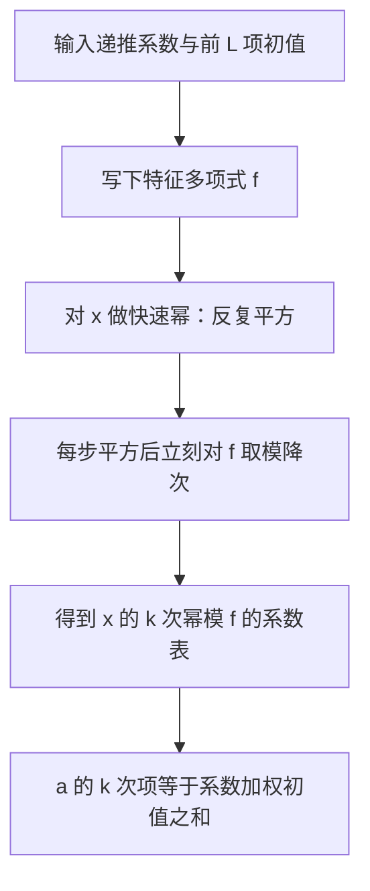
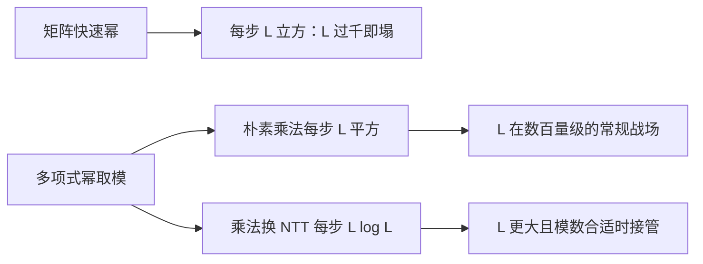

# kitamasa

求线性递推第 $k$ 项不必造 $k$ 行矩阵：把 $x^k$ 对特征多项式取模，余下的系数就是初值的加权表。

<footer>—— 据 C. M. Fiduccia 的线性递推多项式算法, 1985；算法竞赛社区通称的 Kitamasa 方法</footer>

[上一课](/cs/berlekamp-massey)把递推式从序列里挖出来；式子到手，下一个问题是第 $10^{18}$ 项。朴素递推 $O(k)$ 出局，矩阵快速幂 $O(L^3\log k)$ 在 $L$ 上千时也塌。缺口是 **Kitamasa 法**：把指数问题搬进多项式余数世界，$O(L^2\log k)$。本课不重讲 BM，只管「拿到递推之后」。

## 问题

设 $a_i=\sum_{j=1}^{L} c_j a_{i-j}$，初值 $a_0..a_{L-1}$ 已知，求 $a_k\bmod p$，$k$ 可到 $10^{18}$。矩阵幂是对的做法但不是快的做法——每步乘一个 $L\times L$ 矩阵，$L=2000$ 时单步就是 $8\times 10^9$ 次乘法。本课不写：非齐次项的补常数技巧、同一递推批量多点求值（那是多项式多点求值的地盘）。

术语翻译：特征多项式 $f(x)=x^L-\sum_j c_j x^{L-j}$；「对特征多项式取模」就是把 $x^L$ 按 $f$ 的规则拆成低次项之和，与递推式逐字对应。

## 方法

核心恒等式一句话：$a_k=\sum_j [x^k\bmod f(x)]_j\cdot a_j$，余式的系数即权重。三步走——写下 $f$；把 $x$ 做快速幂，反复平方，每步平方后立刻对 $f$ 取模降次；把余下的系数当成初值的加权表求和。

复杂度逐项拆：平方加取模是两次 $O(L^2)$ 多项式乘法，再乘 $\log k$ 轮。乘法换 [FFT](/cs/fft) 一档的 NTT 能再降到 $O(L\log L\log k)$。

数字实例：斐波那契的特征多项式 $f(x)=x^2-x-1$。逐次取模得 $x^5\bmod f=5x+3$，于是 $a_5=5a_1+3a_0=5\times 1+3\times 0=5$——余式系数就是加权初值的账单。

## 机制

为什么对 $f$ 取模合法：递推式逐字翻译成多项式语言，正是 $x^L\equiv\sum_j c_j x^{L-j}$（模 $f$）。于是「按递推移位一步」与「多项式乘 $x$ 后按 $f$ 降次」是同一件事的两种记法；快速幂只是把重复乘法折叠成平方。两个世界同构，指数再大也只在余数世界里走 $\log k$ 步。

直觉类比：递推像钟表——$x$ 每长一「阶」就得绕回表盘、按 $f$ 的规矩归位。平方后取模相当于把「走 $2^t$ 小时」压缩成看一次快进齿轮；齿数由 $f$ 决定，走再久也只在表盘刻度里转。

## 边界

递推必须已知——常与上一课 BM 配套：先扫序列拿递推，再交给本课算远项。初值至少要够 $L$ 项，缺项时回头检查 BM 报的长度。$L$ 只有 $3$、$4$ 时直接写矩阵更快更稳，别为省事硬上多项式乘法；$L$ 上千、$k$ 上 $10^{18}$ 才是本课主场。取模数要配得上乘法：NTT 友好模数之外的素数走拆系数卷积或三模数合并。

常见误区：平方后攒着不取模、想最后统一降次——一次平方度数翻倍，两三轮后多项式长度指数爆炸，内存先于正确性出事。错在漏掉「每步必须降次」这条节律。

## 小结

- $a_k$ 等于 $x^k\bmod f(x)$ 的系数加权初值，这就是 Kitamasa 恒等式。
- 快速幂反复平方、每步对 $f$ 取模，$O(L^2\log k)$，乘法换 NTT 再降一档。
- 矩阵幂与多项式幂是同一递推的两种代数包装，规模差一个因子 $L$。
- 出处：C. M. Fiduccia, *An Efficient Formula for Linear Recurrences*, SIAM J. Comput., 1985；算法竞赛社区通称 Kitamasa 方法。
