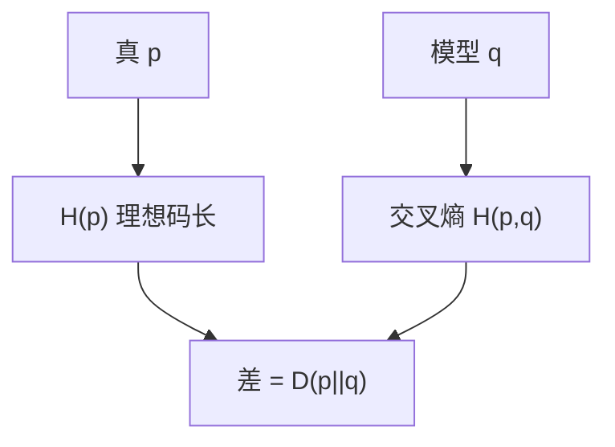

# KL 散度与交叉熵

$D(p\|q)=\sum p\log\frac{p}{q}$ 是用 $q$ 给真正来自 $p$ 的符号编码时，多付的平均比特；交叉熵 $H(p,q)=H(p)+D(p\|q)$。

<footer>—— 据 Kullback and Leibler, 1951；Cover and Thomas 整理</footer>

上一课[率失真](/cs/rate-distortion) 的目标里出现 $I(X;\hat X)=D(p(x,\hat x)\|p(x)p(\hat x))$。主干[熵](/cs/entropy-bits) 有 $H$，互信息课有 $I$。缺口是把**相对熵**写成编码多付的比特，并接上交叉熵——后课最大熵、以及别处训练损失都用这个差，本栏只钉信息论。

## 问题

$D(p\|q)\ge 0$，等号当 $p=q$（Gibbs）。不对称：$D(p\|q)\ne D(q\|p)$。不是度量。编码：若按 $q$ 做理想码长 $-\log q$，真实期望是 $-\sum p\log q=H(p,q)$，比 $H(p)$ 多 $D(p\|q)$。模型错了，压缩变差，下界仍是真熵。

链式：$D(p(x,y)\|q(x,y))=D(p(x)\|q(x))+D(p(y|x)\|q(y|x))$。互信息 $I(X;Y)=D(p(x,y)\|p(x)p(y))$。

### 不是「距离」也不是准确率

KL 可无穷（$q$ 在 $p$ 的支撑上为零）。交叉熵最小 $\ne$ 分类正确率最大，除非把 $q$ 解释成 softmax 一类模型——那是用法，本课定义不依赖标签。

Kullback–Leibler 1951。Cover–Thomas 第 2 章。Sanov、大偏差把 $D$ 当指数速率，点名。本课不把注意力或 token 损失写进主线。

## 方法

用二元 $p\ne q$ 算一个数，解释多付的比特。强调顺序：$p$ 真、$q$ 码本。对照 Hamming：几何距离不管 $p$；KL 不管几何，只管测度。

## 机制

有了 $D$，最大熵「在约束下让 $p$ 尽量无偏」可写成最小化相对均匀的 $D$，下一课。信道、率失真的优化都是在凸集上动 $D$ 或 $I$。本课只把尺子交到手上。

数据处理：Markov 链上 $D$ 不增，点名。

Pinsker：$\|p-q\|_1^2 \le 2D(p\|q)$，把 KL 换成全变差。数据处理：Markov $X\to Y\to Z$ 则 $D(p_Z\|q_Z)\le D(p_Y\|q_Y)$。交叉熵作为训练损失时，$p$ 是经验分布、$q$ 是模型——那是用法；本课定义不依赖样本。反向 KL 与正向 KL 的零强迫不同，变分推断点名。

## 边界

本课不引入 $f$-散度族全文，不证 Pinsker。不把反向 KL 与正向 KL 的变分推断写完。后课默认：$D(p\|q)$ 是额外码长；交叉熵 $=H+D$。下一课最大熵原理。

$p$ 是真、$q$ 是码本或模型，顺序不能翻。$D$ 不是度量，可以无穷。互信息是到独立乘积的 KL，率失真与信道都在这把尺子上优化。

## 小结

- $D(p\|q)$ 非负、不对称；编码解释为多付比特。
- 交叉熵 $=H(p)+D(p\|q)$。
- $I$ 是到乘积分布的 KL。
- 出处：Kullback and Leibler, 1951；Cover and Thomas。
