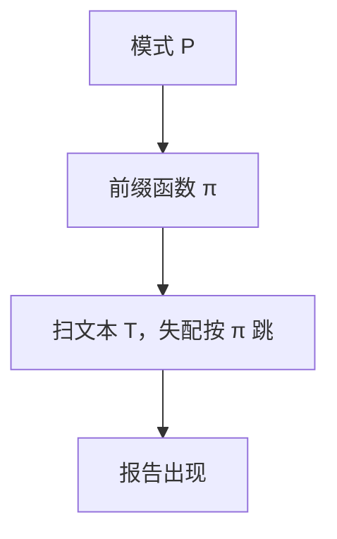

# KMP 串匹配

模式在失配处已经对齐过的前缀信息，足够决定下一步滑到哪，而不把文本指针回退。

<footer>—— 据 Knuth, Morris and Pratt, Fast Pattern Matching in Strings, 1977；CLRS 第 32 章整理</footer>

上一课[二分图匹配](/cs/bipartite-match)收束了图上的组合优化主干。串是另一类对象：文本 $T$、模式 $P$，问 $P$ 是否作为连续片段出现。本课不把串当图的路径。缺口是：朴素匹配最坏 $\Theta(nm)$，每次失配把 $T$ 的指针往回退。KMP 预计算 $P$ 的前缀函数，扫描 $T$ 只前进。

## 问题

朴素：每个起点 $s$ 比较 $P$ 与 $T[s..]$。最坏如 $aaa\ldots b$ 对 $aa\ldots ab$。缺口不是哈希（那是期望），而是**确定性线性**：预处理 $P$ 得 $\pi$，使 $\pi[q]$ 为真前缀 $P[1..q]$ 的最长真后缀长度且该后缀也是前缀。匹配时失配跳到 $\pi[q]$， $T$ 的下标不减。

总时间 $\Theta(n+m)$。仍在 P，比较模型换成字符相等。

### 前缀函数不是失败时的「往左数一格」

$\pi$ 来自 $P$ 自己的周期。错用 $\pi[q]-1$ 或固定滑 $1$ 会漏匹配或退回平方。$\pi$ 的计算本身是对 $P$ 的「自匹配」，同一套转移。

Knuth–Morris–Pratt 1977 把 Morris–Pratt 的思想写成线性最坏。Boyer–Moore 从右扫，本课不并行展开。后课词法用正则，那是语言而非单模式精确匹配。

## 方法

先算 $\pi[1..m]$：$q$ 从 $0$ 扫 $P$，失配时 $q\leftarrow\pi[q]$。再扫 $T$：同样转移，当 $q=m$ 报告一次出现，$q\leftarrow\pi[m]$ 找下一个。

字符表大小不进渐近的主导项；比较是相等测试。多模式要用 Aho–Corasick，本课单模式。

## 机制

文本指针单调，故 $O(n)$ 次转移；$\pi$ 的摊还同样：$q$ 的增减有势函数。与[摊还分析](/cs/amortized-analysis)同类记账，本课不重写势能定义。

哈希匹配（Rabin–Karp）期望线性、最坏平方，模型不同。本课要最坏线性。

## 边界

本课不做正则、不写近似匹配、不处理通配符。二维匹配、后缀数组是另一课序，不插入。流式只需 $\pi$ 与当前 $q$，不必存整份 $T$ 的回退。

后课默认：单模式精确匹配最坏 $\Theta(n+m)$ 用 KMP。贪心作为设计法的正确性论证是下一缺口。

## 小结

- 前缀函数把失配变成模式内部的跳转，$T$ 指针不回退。
- 预处理加扫描 $\Theta(n+m)$。
- 单模式；正则与多模式不是本课。
- 出处：Knuth, Morris and Pratt, 1977；CLRS 第 32 章。
