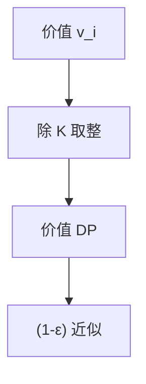

# 背包 FPTAS

0-1 背包伪多项式 $O(nW)$ 或 $O(nV)$；按价值缩放丢掉低位，$(1-\varepsilon)$ 近似且时间 $\mathrm{poly}(n,1/\varepsilon)$。

<footer>—— 据 Ibarra and Kim, Fast Approximation Algorithms for the Knapsack and Sum of Subset Problems, 1975；CLRS 第 35.5 节；[背包](/cs/knapsack) 整理</footer>

上一课[LP 舍入](/cs/lp-rounding)依赖间隙。背包有 FPTAS：任意 $\varepsilon$，多项式于 $n$ 与 $1/\varepsilon$。主干背包 DP $\Theta(nW)$，$W$ 大则非多项式于输入位数。缺口是缩放。不重写 0-1 转移。后课局部搜索最大割。

## 问题

价值 $v_i$，容量 $W$。DP 按容量或按价值。FPTAS：令 $K=\varepsilon v_{\max}/n$，把 $v_i$ 换成 $\lfloor v_i/K\rfloor$，对价值做 DP，容量仍精确检查。相对误差 $\le\varepsilon$。时间 $O(n^3/\varepsilon)$ 量级（随实现）。

缺口是缩放，不是贪性价比（那不是 FPTAS，最坏可差）。

### 不是所有 NPC 都有 FPTAS

强 NPC（三维匹配等）无 FPTAS（除非 P=NP）。背包弱 NPC，伪多项式 $\Rightarrow$ 常有 FPTAS。

Ibarra–Kim 1975。CLRS 35.5。后课最大割局部搜索 2-近似/期望。

## 方法

找 $v_{\max}$。缩放。价值 DP：$O(n^2/\varepsilon)$ 状态级。还原选品。

完全背包、分数背包更易，点名。

## 机制

每个物品价值误差 $\lt K$，最多 $n$ 件，总误差 $\lt \varepsilon v_{\max}\le\varepsilon\,\mathrm{OPT}$（若 OPT $\ge v_{\max}$）。容量约束未放松。与伪多项式：状态值域变成 $O(n^2/\varepsilon)$。与 PTAS：FPTAS 要 $\mathrm{poly}(n,1/\varepsilon)$，PTAS 允许 $n^{f(1/\varepsilon)}$。

## 边界

本课不写多维背包。不写 EPTAS。后课默认：0-1 背包有 FPTAS。下一课局部搜索与最大割。

## 小结

- 缩放价值 + DP = FPTAS。
- 弱 NPC 才有此路。
- 贪心性价比不是 FPTAS。
- 出处：Ibarra and Kim, 1975；CLRS 第 35.5 节。
