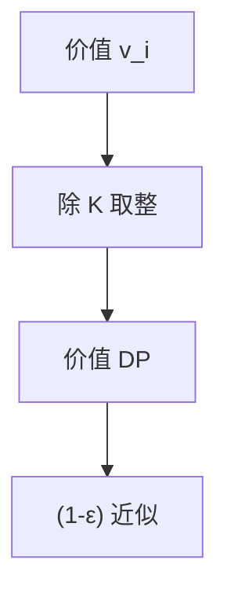
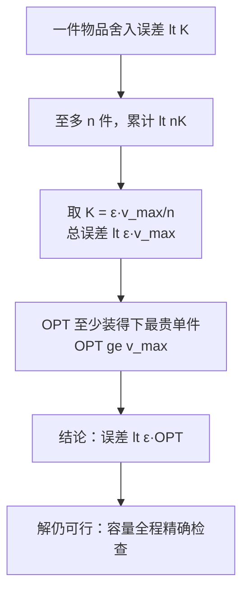

# 背包 FPTAS

0-1 背包伪多项式 $O(nW)$ 或 $O(nV)$；按价值缩放丢掉低位，$(1-\varepsilon)$ 近似且时间 $\mathrm{poly}(n,1/\varepsilon)$。

<footer>—— 据 Ibarra and Kim, Fast Approximation Algorithms for the Knapsack and Sum of Subset Problems, 1975；CLRS 第 35.5 节；[背包](/cs/knapsack) 整理</footer>

上一课[LP 舍入](/cs/lp-rounding)依赖解的间隙结构；背包更幸运，有 FPTAS：对任意 $\varepsilon$，运行时间多项式于 $n$ 与 $1/\varepsilon$。主干背包 DP $\Theta(nW)$ 的麻烦在 $W$ 大时它不是输入规模的多项式——$W$ 在输入里只占 $\log W$ 位。缺口是缩放：把大数值压小，同时控制住误差。本课不重写 0-1 转移；后课局部搜索转向最大割。

## 问题

价值 $v_i$，容量 $W$，DP 可按容量也可按价值展开。FPTAS 令 $K=\varepsilon v_{\max}/n$，把每个价值 $v_i$ 换成 $\lfloor v_i/K\rfloor$，对缩放后的价值做 DP，容量约束仍精确检查。相对误差 $\le\varepsilon$，时间 $O(n^3/\varepsilon)$ 量级（随实现而变）。

缺口是缩放，不是贪性价比——按单位重量价值贪心没有近似比保证，构造一组「一件超贵重物加一堆恰好塞满的低价值物」就能让它差到任意倍。

### 不是所有 NPC 都有 FPTAS

强 NPC 问题（三维匹配等）若再有 FPTAS 就推出 P=NP；背包只是弱 NPC——难点在数值大而非组合结构本身，伪多项式时间存在，所以常有 FPTAS 跟进。

Ibarra–Kim 1975。CLRS 35.5。后课最大割局部搜索 2-近似/期望。

## 方法

四步：找 $v_{\max}$ 定出缩放因子 $K$；把每个 $v_i$ 换成 $\lfloor v_i/K\rfloor$；对缩放价值做 DP，状态值域压到 $O(n^2/\varepsilon)$；沿 DP 表回代还原选品。

```mermaid
flowchart TD
  V["价值 v_i"] --> SC["除 K 取整"]
  SC --> DP["价值 DP"]
  DP --> EPS["(1-ε) 近似"]
```

完全背包与分数背包本就更容易，点名即可：分数背包按密度贪心即最优，完全背包的 DP 也不需要缩放技巧。

## 机制

误差账这样算：每个物品的舍入误差 $\lt K$，至多 $n$ 件，总误差 $\lt nK=\varepsilon v_{\max}\le\varepsilon\,\mathrm{OPT}$（末步用 OPT $\ge v_{\max}$：最优解至少装得下单件最贵物）。容量约束从未放松，解总是可行。与伪多项式的关系是关键：$O(nW)$ 的毛病是 $W$ 可指数于输入位数，缩放后状态值域只随 $n^2/\varepsilon$ 长，才真正多项式。与 PTAS 的差别在时间表：FPTAS 要求 $n$ 与 $1/\varepsilon$ 双双多项式，PTAS 允许 $n^{f(1/\varepsilon)}$ 这种在 $1/\varepsilon$ 上指数的表。

那张不等式链就是保证的全部来源；这张图把它串成一条线，回答「凭什么敢丢低位」。

```mermaid
flowchart TD
  R1["一件物品舍入误差 lt K"] --> R2["至多 n 件，累计 lt nK"]
  R2 --> R3["取 K = ε·v_max/n<br>总误差 lt ε·v_max"]
  R3 --> R4["OPT 至少装得下最贵单件<br>OPT ge v_max"]
  R4 --> R5["结论：误差 lt ε·OPT"]
  R5 --> OK["解仍可行：容量全程精确检查"]
```

数字实例：$n=100$ 件、$v_{\max}=10^6$、$\varepsilon=0.1$ 时 $K=10^3$；价值 123456 记成 123，零头 456 被丢掉。DP 状态值域从百万级压到约 $n^2/\varepsilon=10^5$ 级，而总误差不超过 $\varepsilon\cdot v_{\max}=10^5$——「只记到千元位」换来十倍以上的状态压缩。

直觉类比：缩放就是换记账单位——原来精确到分，现在只记到千元；每笔账最多差一个不足千元的零头，一百笔账的零头加起来也不过十万，相对「总盘子」是个可控的小比例。FPTAS 的全部艺术在于把零头总和钉死在 $\varepsilon$ 倍最优解以内。

术语翻译：FPTAS 全称「完全多项式时间近似方案」，拆开读：近似方案=对每个精度要求 $\varepsilon$ 给一套算法；多项式时间=耗时同时多项式于输入规模 $n$ 和 $1/\varepsilon$；完全（F）=连 $1/\varepsilon$ 也不能出现在指数上——这是它比 PTAS「更体面」的那一档。

## 边界

本课不写多维背包——两维以上即是强 NPC，FPTAS 随之丧失（除非 P=NP）。不写 EPTAS。后课默认：0-1 背包有 FPTAS。下一课局部搜索与最大割。

## 小结

- 缩放价值 + DP = FPTAS。
- 弱 NPC 才有此路。
- 贪心性价比不是 FPTAS。
- 出处：Ibarra and Kim, 1975；CLRS 第 35.5 节。
