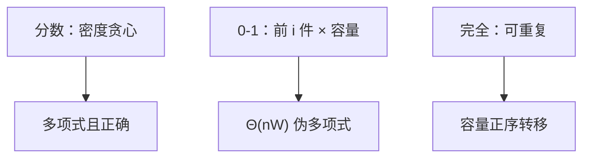

# 背包

容量是状态的一维；每件物品选或不选（或可重复）变成对这一维的转移。

<footer>—— 据 Dantzig, Discrete-Variable Extremum Problems, 1957；CLRS 第 16、34 章相关讨论整理</footer>

上一课[最优子结构与重叠](/cs/opt-substructure)给了状态与转移的骨架。贪心课已声明 0-1 背包按密度贪心会错。本课不重讲备忘。缺口是：把**容量 $W$ 与物品前缀**写成具体 DP，并分清分数、0-1、完全三种。算法课仍在多项式：$W$ 记入输入时伪多项式；NP 课再解释「伪」。

## 问题

$n$ 件物品，重量 $w_i$、价值 $v_i$，容量 $W$。分数背包：可切，按 $v_i/w_i$ 贪心正确（交换论证）。0-1：每件至多一次，密度贪心有反例，DP：$dp[i][w]$ 为前 $i$ 件、容量 $w$ 的最大价值，转移用或不用第 $i$ 件，$\Theta(nW)$。完全背包：每件可用多次，内层容量递增或改转移。

缺口是这张表，不是线性规划单纯形。物品为整数、容量为整数。

### $\Theta(nW)$ 不是 $n$ 的多项式

输入长度是 $\Theta(n\log W+\sum\log w_i)$，$W$ 指数于位数时表是指数大。这叫伪多项式。本课仍把它当可用算法；是否 NP-完全留给后课，不要在本课重定义图灵机。

分数背包的贪心在 Dantzig 1957 已常见。0-1 的 DP 是标准教科书构造。空间可滚成一维 $W$ 数组：0-1 必须逆序更新以免一件用两次。

## 方法

0-1：`for i`，`for w=W..w_i`：$dp[w]\leftarrow\max(dp[w],dp[w-w_i]+v_i)$（一维滚动）。完全：`w` 正序。分数：排序密度，依次装满。

最优子结构：用了第 $i$ 件则剩余是 $i-1$ 件、$W-w_i$ 的最优。贪心选择性质只对分数成立。

## 机制

多维容量（二维背包）加一维状态。分组、依赖是转移上的约束，骨架不变。输出方案需记录是否选用，或事后回溯。

与最短路：完全背包像在容量 DAG 上最长路。不要把负权环请进来：容量单调增加，无环。

## 边界

本课不证 0-1 背包 NP-完全，只承认 $W$ 大时 DP 不可行。近似方案（FPTAS）不进主干。物品切分的物理含义只在分数模型。后课 P/NP 用判定版子集和作入口之一，会链回本课的伪多项式。

后课默认：分数贪心；0-1/完全用容量 DP；$\Theta(nW)$ 随 $W$ 伪多项式。复杂度类下一课才命名。

## 小结

- 分数背包贪心正确；0-1 与完全用容量 DP。
- $\Theta(nW)$ 伪多项式；$W$ 的位数大则爆。
- 一维滚动时 0-1 逆序、完全正序。
- 出处：Dantzig, 1957；CLRS 第 15–16 章。
