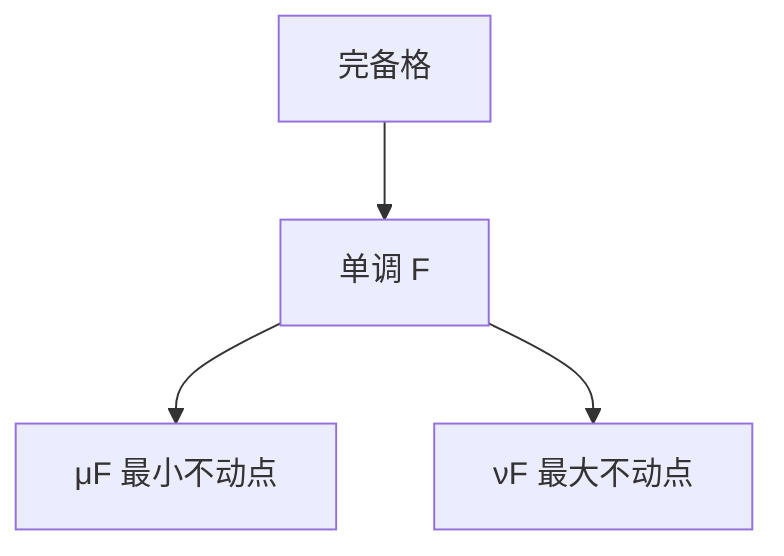

# 不动点与 Knaster–Tarski

完备格上单调函数必有最小、最大不动点，分别是从底迭代的并与从顶迭代的交。循环语义、类型、时序逻辑都用这一颗钉子。

<footer>—— 据 Tarski, A Lattice-Theoretical Fixpoint Theorem, 1955；Winskel 整理</footer>

上一课[最弱前置](/cs/weakest-precondition) 把 while 写成方程 $I=\Phi(I)$。[λ 课的 $Y$](/cs/combinators-fixed-point) 是语法等式，不管最小。缺口是**格上的定理**：Knaster–Tarski。模型检验用 $\mu,\nu$ 算可达与循环，本课先给数学。

## 问题

完备格：任意子集有上确界、下确界（幂集、断言蕴含的商）。$F$ 单调：$x\le y\Rightarrow F(x)\le F(y)$。则 $\mu F=\bigwedge\{x\mid F(x)\le x\}$ 是最小不动点，$\nu F=\bigvee\{x\mid x\le F(x)\}$ 最大。Kleene：若 $F$ 连续，则 $\mu F=\bigvee_n F^n(\bot)$。有限格上从 $\bot$ 迭代必停。

部分正确的循环不变量可看成某种前不动点；存活、无穷路径常用最大不动点。

### 不是 Banach 压缩

度量空间的压缩映像是另一定理，要距离。这里是序。不要把 $Y$ 与 $\mu$ 写成同一个对象：无类型 $Y$ 不保证最小。

Tarski 1955；Knaster 更早的集合论形式。Winskel、Clarke et al. 模型检验教材用 $\mu$-演算。本课不写 $\mu$-演算语法全文。

## 方法

在有限幂集上取 $F(X)=\{s_0\}\cup\mathrm{Post}(X)$，最小不动点 = 可达。对偶 $\nu$ 给「总能回到」。指出：抽象解释把格换成抽象域，单调保证迭代有意义，精度另说。

## 机制

有了 $\mu/\nu$，CTL 的 $\mathrm{EF},\mathrm{EG}$ 可定义成不动点，下一课模型检验具体算。Hoare 不变式是人提供的前不动点上界；算法要从 $\bot$ 爬。有限状态保证停；无限状态要抽象或归纳。

与递归定理：那里保证 TM 编码不动点存在，不给最小语义。

Kleene 链：$\bot\le F(\bot)\le F^2(\bot)\le\cdots$，连续时并就是 $\mu F$。有限格上单调即连续。抽象解释：Galois 连接把具体 $\mu$ 换成抽象格上的过近似，可靠但不完备。类型推导、数据流分析（到达定义）都是同一迭代，主干编译课已见，此处给定理名。

## 边界

本课不证 Tarski 全文，不引入范畴论初始代数。不把微分方程当不动点课。后课默认：循环与时序性质 = 单调算子的 $\mu/\nu$。下一课模型检验直觉。

幂集上的后像、$\mathrm{wp}$ 的循环、CTL 的 $\mathrm{EF}/\mathrm{EG}$ 都是单调 $F$ 的 $\mu/\nu$。有限则迭代可算。无类型 $Y$ 不保证最小，不要混用。模型检验下一课开始落地。

上一课留下的缺口在本课收口；「不动点与 Knaster–Tarski」进入后课词汇表后只引用。文献用来钉对象与边界，不把本课写成该主题的独立综述。

## 小结

- 完备格 + 单调 $F$ $\Rightarrow$ 最小/最大不动点。
- 有限时 Kleene 迭代可算；可达是典型 $\mu$。
- 与无类型 $Y$ 分工：语义最小 vs 语法等式。
- 出处：Tarski, 1955；Knaster；Winskel。
