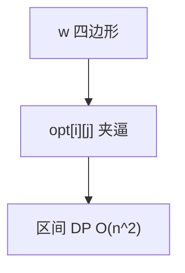

# 矩阵链与 Knuth 优化

矩阵链乘法的最优加括号是区间 DP；Knuth 的 $opt$ 单调把切点枚举从 $O(n)$ 收到均摊 $O(1)$，总 $O(n^2)$。

<footer>—— 据 Godbole, 1973；Knuth, 1971；Yao, 1980；CLRS 第 15.2 节整理</footer>

上一课[最优二叉搜索树](/cs/optimal-bst)已用 Knuth 单调。主干[区间 DP](/cs/interval-dp)写过矩阵链 $O(n^3)$。缺口是把 Knuth 优化钉在矩阵链（及满足四边形的同类）上，作为 DP 进阶课序收束。不重写 $dp[i][j]=\min_k dp[i][k]+dp[k+1][j]+p_{i-1}p_k p_j$。下一单元字符串 Z 函数。

## 问题

切点 $opt[i][j]$ 对矩阵链满足 $opt[i][j-1]\le opt[i][j]\le opt[i+1][j]$（在代价满足四边形时）。填 $j-i$ 递增时，$k$ 只扫这段，$ \sum(opt[i][j]-opt[i][j-1])$ 均摊使总 $O(n^2)$。

缺口是范围收缩，不是 Strassen 的块乘。矩阵链优化的是**加括号次数代价**，每个 $\times$ 仍是普通矩阵乘。

### 不是所有区间 DP 都能 Knuth

石子合并若代价不满足四边形就不能。先验证 $w(i,j)+w[i',j']\le w(i,j')+w(i',j)$ 一类。不会证就留 $O(n^3)$ 或用分治优化（更弱条件）。

CLRS 15.2 矩阵链。Knuth 原为 BST。Yao 推广。后课 Z 函数离开 DP。

## 方法

标准区间 DP 框架，`k` 从 `opt[i][j-1]` 到 `opt[i+1][j]`。存 $opt$。对照 BST 同一循环。

输出加括号方案用 $opt$ 递归。

## 机制

更长区间的最优切点夹在较短区间切点之间，故枚举不回头。与 SMAWK：Knuth 针对二维区间表的 $opt$ 二维单调；SMAWK 针对一层 $i$–$j$ 矩阵。与 CHT：结构不同。

## 边界

本课不写高精度矩阵代价。不写并行加括号。DP 进阶到此：后课默认区间 DP 先看四边形/Knuth/分治/CHT。下一课 Z 函数，串算法。

## 小结

- 矩阵链代价区间 DP；Knuth 收 $O(n^2)$。
- 条件是四边形 + $opt$ 夹逼。
- 优化括号不是优化一次矩阵乘的 $\omega$。
- 出处：Godbole, 1973；Knuth, 1971；Yao, 1980；CLRS 第 15.2 节。
