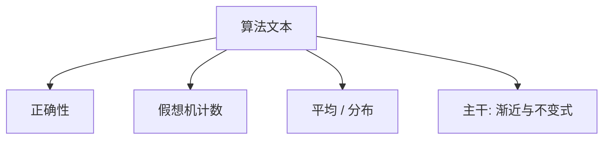

# Knuth TAOCP

把算法写成可分析的对象：正确性、MIX 上的步数、最坏与平均；卷册是分析的仓库，不是课序本身。

<footer>—— Knuth, The Art of Computer Programming（多卷，自 1968 年起）</footer>

[上一课](/cs/shannon-1948-paper)附录对照了通信数学。附录对照，不插入主干。主干已在[循环不变式](/cs/shannon-1948-paper)、[渐近记号](/cs/asymptotic-notation)、[分治](/cs/divide-conquer)、排序与查找各课用过「先写对、再计数」；这里对照 **TAOCP 的问题**：把具体算法写成可被数学分析的文本，并用 MIX/MMIX 当同一台假想机。不把七卷目录抄进课序。

## 问题

CLRS 与本栏算法课已经给了主定理与排序下界。Knuth 的缺口是工程与分析同一本书：随机数据下的平均、精确到指令的 MIX 计数、以及把离散对象的生成函数当工具。主干不采用 MIX 当 ISA 课——[RISC-V](/cs/riscv-int-isa) 才是组成课的指令。附录只对照「算法值得分析到常数与分布」这一立场。

第一卷基础、第三卷排序与查找，是主干引用最多的部分。不要把未完成卷的传闻当文献。

## 方法

对每一个算法：不变式或归纳、然后在假想机上计数。平均分析假设输入分布。这与主干「渐近为主、常数留给实现」互补：TAOCP 更愿意把 $A$ 与 $B$ 算到项。B 树、哈希、堆，主干数据结构课已经用外存与局部性改写过 Knutt 式分析的对象。

## 机制

假想机让「一步」有定义，避免高级语言隐藏分配。主干组成课用真实 ISA 做同一件事，对象换成流水线与 Cache。TAOCP 不处理并发与分布式，那些是 Dijkstra、Lamport 附录。本附录不把文学编程当课序要求。

### 为何对照而不插入主干

若按 TAOCP 卷序上课，本栏会在排序里停年。主干按知识树：结构 → 算法 → 编译 → 系统。Knuth 是分析风格的对照，不是「排序课应改用 MIX」。

## 边界

不要把 TAOCP 与 CLRS 争「正统教材」。下一篇对照 Dijkstra 1965 如何把互斥写成进程合作，那是 OS 同步课已经取用的观念。

组合生成与精确计数在 TAOCP 很重，主干[组合计数](/cs/counting-combinatorics)只取够用的一层，不按卷册展开。

对照结束应回到主干算法与数据结构课的渐近与不变式，而不是改用 MIX 当组成课 ISA。

## 小结

- 附录对照 Knuth TAOCP：算法可被正确性加计数双重分析。
- 主干用渐近与 RISC-V，不插入 MIX 课序。
- 并发不是这套卷册的中心，见 Dijkstra 附录。
- 出处：Knuth, *The Art of Computer Programming*。
