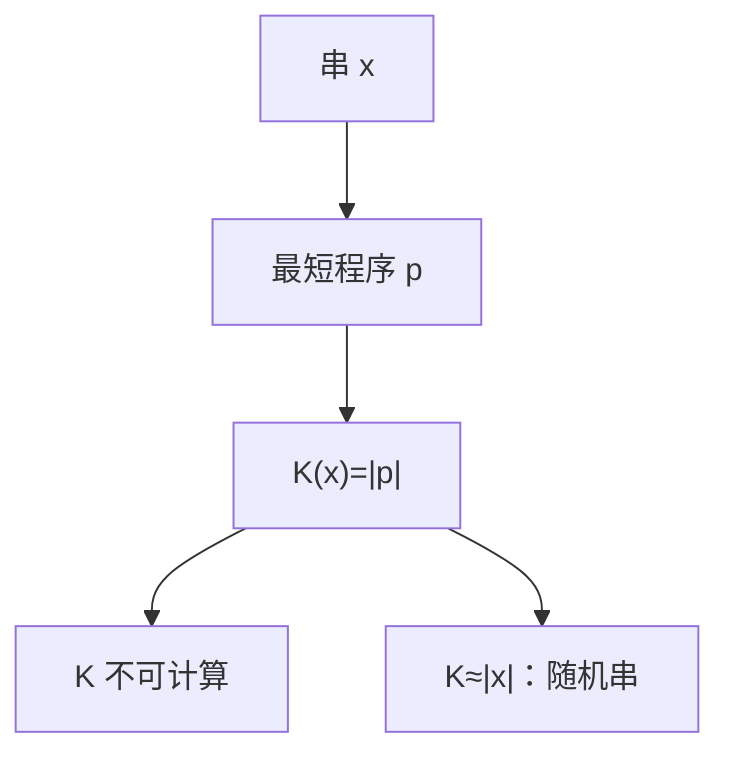

# Kolmogorov 复杂度

串 $x$ 的复杂度是打印 $x$ 然后停机的最短程序长度；几乎所有串都接近最大，而 $K$ 本身不可计算。

<footer>—— 据 Kolmogorov, 1965；Chaitin；Li and Vitányi, An Introduction to Kolmogorov Complexity 整理</footer>

上一课[递归定理](/cs/recursion-theorem)让程序可以谈自身。缺口是给串一个**描述长度**，不依赖概率。[熵](/cs/entropy-bits)是分布上的平均；这里单根串、最坏描述。本课钉 $K(x)$、不可计算、与随机串。

## 问题

固定通用 TM（前缀自由或普通，差一个加性常数）。$K(x)=\min\{|p|:\ U(p)=x\}$。显然 $K(x)\le |x|+O(1)$（硬编码）。不可计算：若 $K$ 可计算，可枚举「$K(x)\ge n$ 的最短 $x$」，其描述「第 $n$ 个不可压缩串」长度 $O(\log n)$，矛盾——Berry 悖论的可计算版，合法性靠递归定理。

随机串： $K(x)\ge |x|-c$。多数串如此（计数：短程序太少）。这与「通过统计检验」不同，但是 Martin-Löf 随机在前缀 $K$ 下可对齐，本课点名。

### 不是 Shannon 熵

熵要 $p(x)$。均匀分布下典型串的 $K$ 约 $n$，与熵同阶；换分布，熵低的源仍有个别高 $K$ 的串。不要把压缩软件的输出长度写成 $K$——那是上界，且相对具体格式。

Kolmogorov 1965；Solomonoff、Chaitin 同期。Li–Vitányi 是标准书。前缀复杂度 $K$ 让 Kraft 不等式可用；课堂常先讲普通 $C(x)$，差 $O(\log n)$。

## 方法

证明不可计算用「最短不可压缩」自指。应用：不可压缩串没有短循环、不能有太长的 $0$ 段（否则可描述）。条件 $K(x\mid y)$ 点名，不展开链规则全文。

[信源编码](/cs/source-coding-theorem)那里平均码长对 Shannon。这里单串、最坏、相对通用机。

## 机制

$K$ 对可计算变换几乎不变（加常数或对数）。故「是否随机」不依赖编程语言，只要通用。不可判定性：集合 $\{x:K(x)\ge |x|/2\}$ 不可判定。这比停机更「量」：每个串都有一个数，只是算不出。

不要用 $K$ 当文件压缩的目标函数去优化——不可计算。

条件复杂度 $K(x\mid y)$ 是已知 $y$ 时打印 $x$ 的最短程序。对称性 $K(x,y)\approx K(x)+K(y\mid x)$ 差对数项。不可压缩串通过几乎所有可计算统计检验，这是 Martin-Löf 随机的桥，本课不把测度论写完。压缩器给出的长度永远是 $K$ 的上界。

## 边界

本课不证 Martin-Löf 的测度论定义，不引入算法信息的缺一性引理全文。不把大模型的「压缩即智能」写成定理。后课默认：$K(x)$ 是最短程序长，不可计算；随机串是不可压缩串。下一课换模型：λ 演算。

## 小结

- $K(x)$ = 输出 $x$ 的最短程序长；相对通用机差常数。
- $K$ 不可计算；多数串不可压缩。
- 与 Shannon 熵分工：单串 vs 分布。
- 出处：Kolmogorov, 1965；Li and Vitányi。
